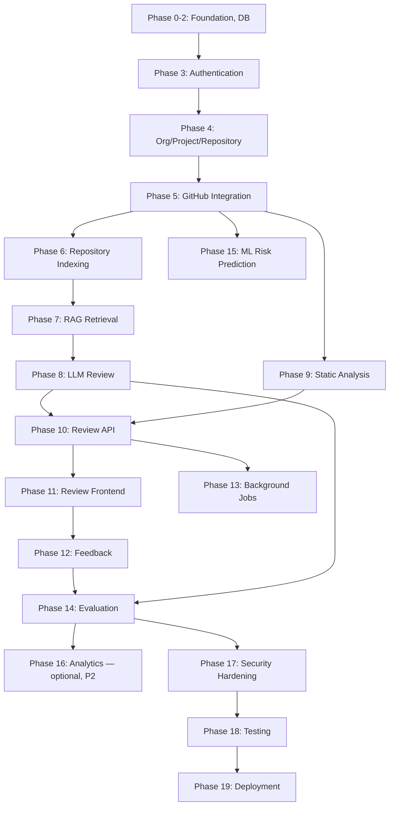

# RepoMind — Implementation Plan


This plan follows the phase order specified in the source materials. Docker references from the source phase table have been replaced with native setup/deployment steps, per the project-wide Docker exclusion (see `01-project/scope.md`).

## Phase Overview

| Phase | Objective | Key Modules/Files | DB Migration | Validation / Acceptance Criteria | Status |
|---|---|---|---|---|---|
| 0 | Project foundation | Repo scaffold (`frontend/`, `backend/`, `worker/`, `database/`), `.env.example` | — | Repository clones and shows the folder structure in `04-development/development-guide.md` | Planned |
| 1 | Backend foundation | `main.py`, `config.py`, health endpoint | — | `GET /health` returns 200 | Planned |
| 2 | Database | SQLAlchemy setup, Alembic migration tooling | Migration 001 skeleton | `alembic upgrade head` runs cleanly against an empty database | Planned |
| 3 | Authentication | `auth/` module | 001 (`user`, `organization`, `organization_membership`) | Login returns a valid session; unauthenticated requests rejected | Planned |
| 4 | Organization/Project/Repository | `organizations/` module | 002 (`project`, `repository`, `github_connection`) | Authenticated org_admin can create org → project → repo via API | Planned |
| 5 | GitHub integration | `github/` module | 003 (`pull_request`, `commit`) | Given a connected repo, can fetch PR diff + docs from real GitHub | Planned |
| 6 | Repository indexing | `rag/loader.py`, `rag/chunker.py` | 004 (`document`, `document_chunk`, pgvector extension) | Docs chunked and stored, tagged with `repository_id` | Planned |
| 7 | RAG retrieval | `rag/embedder.py`, `rag/retriever.py` | (uses 004) | A known query returns the correct chunk; cross-repository isolation test passes | Planned |
| 8 | LLM review | `review/` module | 005 (`review_run`, `finding`, `linter_result`) | Structured, schema-validated findings produced for a real PR | Planned |
| 9 | Static analysis | `linter/` module | (uses 005) | Lint findings stored and tagged separately from LLM findings | Planned |
| 10 | Review API | Review endpoints | — | `POST /pull-requests/{id}/review` creates a job; `GET /review-runs/{id}` returns findings | Planned |
| 11 | Review frontend | PR page + components | — | Findings visible with citations in the UI | Planned |
| 12 | Feedback | `feedback/` module | 006 (`finding_feedback`) | Accept/reject persists and is visible on reload | Planned |
| 13 | Background jobs / re-analysis | `job` table, worker process | 007 (`job`) | Reviews run asynchronously; a new commit triggers re-analysis; findings reconciled as NEW/PERSISTENT/RESOLVED | Planned |
| 14 | Evaluation | `evaluation/` module | 009 (`evaluation_run`) | 3-way comparison table produced and displayed — **the project's central deliverable; not to be delayed by ML** | Planned |
| 15 | ML risk prediction | `ml/` module | 008 (`ml_prediction`) | Regressor/classifier trained; comparison against rule-based baseline shown | Planned |
| 16 | Analytics (P2, optional) | Team/repo trend views only | — | No individual ranking anywhere in schema or UI; built only on explicit request | Future |
| 17 | Security hardening | Secret encryption, audit log | 010 (`audit_log`) | Audit log populated on sensitive actions | Planned |
| 18 | Testing | Full suite (see `06-testing/testing-strategy.md`) | — | AI-evaluation regression suite passes in CI | Planned |
| 19 | Deployment | Native process setup + CI/CD pipeline (no Docker) | — | Staging deploy succeeds from a clean checkout using the native setup in `07-deployment/deployment-guide.md` | Planned |

## Dependency Graph



## Parallelization Notes

- Frontend shell scaffolding can start alongside GitHub integration (Phase 5), using mocked API responses initially.
- Static analysis (Phase 9) has no dependency on RAG (Phase 7) and can be built in parallel with it.
- ML risk prediction (Phase 15) depends only on GitHub integration data, not on RAG/LLM review, and can proceed in parallel once historical PR data is available — but must not delay Phase 14 (Evaluation), which is the project's central research deliverable.
- GitHub integration and static analysis can be built by one contributor while another begins RAG design against mocked documentation data, converging at the LLM review + evaluation phase.

## Recommended Build Order (condensed)

```
Phase 0-2  → Foundation, DB
Phase 3    → Auth
Phase 4    → Org/Project/Repository
Phase 5    → GitHub integration        ⎫
Phase 9    → Static analysis (parallel)⎬ can overlap
Phase 6-7  → Indexing + RAG            ⎭
Phase 8    → LLM review
Phase 10-11→ Review API + frontend
Phase 12   → Feedback
Phase 13   → Async jobs + re-analysis
Phase 14   → Evaluation                (central deliverable — do not let ML delay this)
Phase 15   → ML risk prediction        (parallel-safe once Phase 5 data exists)
Phase 17-19→ Security, testing, deployment (native, no Docker)
Phase 16   → Analytics — build last, and only if a real, specific request appears
```

## Definition of Done (applies to every phase/feature)

A feature is not complete until: code is implemented and type-hinted; unit and integration tests are written and passing; error handling follows the matrix in `06-testing/testing-strategy.md`; security considerations are addressed (auth checks, input validation, no secret leakage); the API is documented; the frontend is connected to the real API (no leftover mock data); a database migration is added if the schema changed; structured logging is added at appropriate points; and acceptance criteria (Given/When/Then style, see `06-testing/test-plan.md`) are written and verified.
