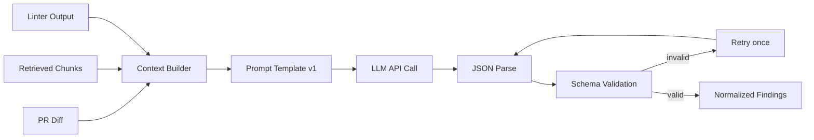
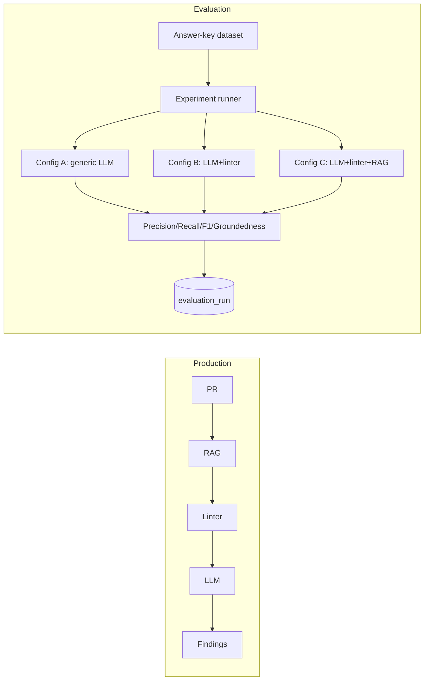

# Diagram — AI Review Pipeline (LLM)

**Status: Confirmed**

Services: `DocumentLoader`, `DocumentFilter`, `Chunker`, `EmbeddingService`, `Retriever` (rag module); `ContextBuilder`, `PromptBuilder`, `LLMClient`, `OutputParser`, `FindingValidator`, `ReviewService` (review module).

Prompt injection defense: repository content (README, docs, PR description, commit messages, code comments) is explicitly labeled in the prompt as **untrusted evidence**, never as system-level instructions. The system instruction is fixed and outside any repository-sourced text; the model is explicitly told not to follow instructions found inside retrieved content. See `05-security/security.md`.

## Evaluation Comparison (kept separate from production inference)

