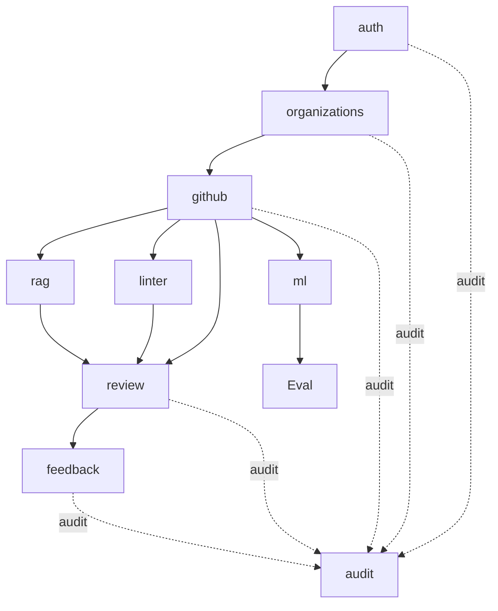

# Diagram — Component Architecture (Backend Modules)

**Status: Confirmed**

```mermaid
flowchart TB
    Auth[auth] --> Org[organizations]
    Org --> GH[github]
    GH --> RAG[rag]
    GH --> Linter[linter]
    RAG --> Review[review]
    Linter --> Review
    GH --> Review
    GH --> ML[ml]
    ML --> Eval
    Review --> Feedback[feedback]
    Auth -.audit.-> Audit[audit]
    Org -.audit.-> Audit
    GH -.audit.-> Audit
    Review -.audit.-> Audit
    Feedback -.audit.-> Audit
```

