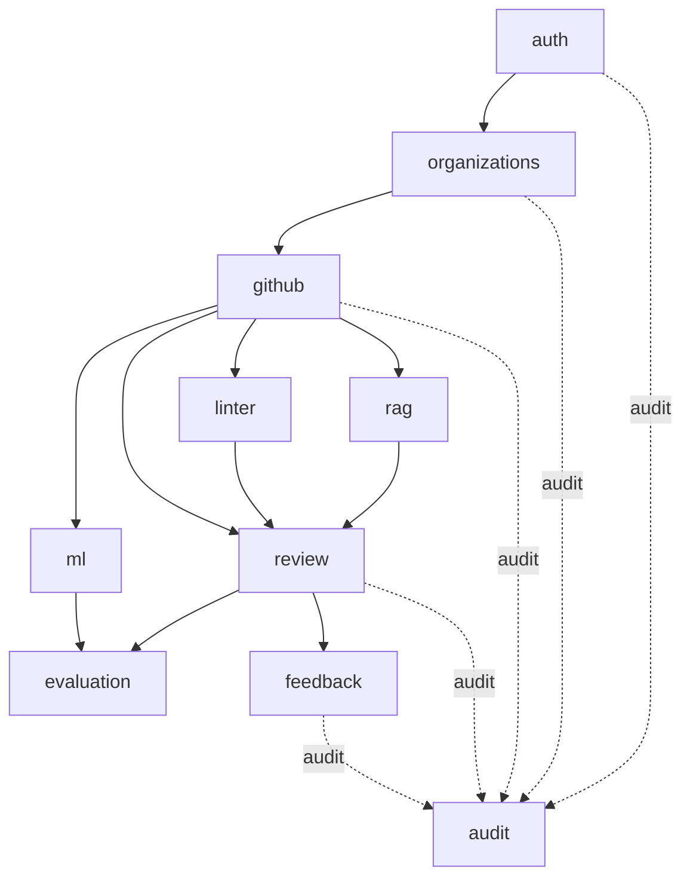

# Diagram — Component Architecture (Backend Modules)

**Status: Confirmed**

Dependency direction is strictly one-way. `github` has zero AI dependencies — a pure adapter. `evaluation` is a leaf: nothing depends on it. `audit` observes actions across modules without other modules depending on it.
