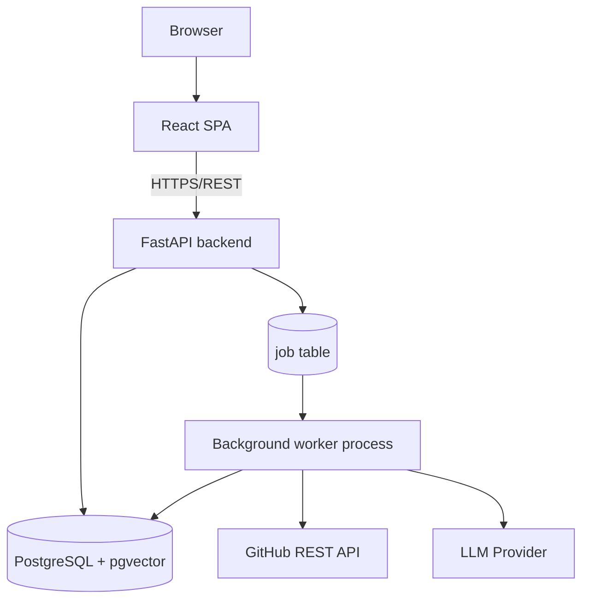

# Diagram — Container Architecture

**Status: Confirmed**

Four containers/processes in the current scope: the React frontend, the FastAPI backend, the PostgreSQL database (with `pgvector`), and the background worker process. No separate frontend/backend/worker deployment containers beyond process-level separation — and no Docker is used to achieve that separation (see `07-deployment/deployment-guide.md`).
