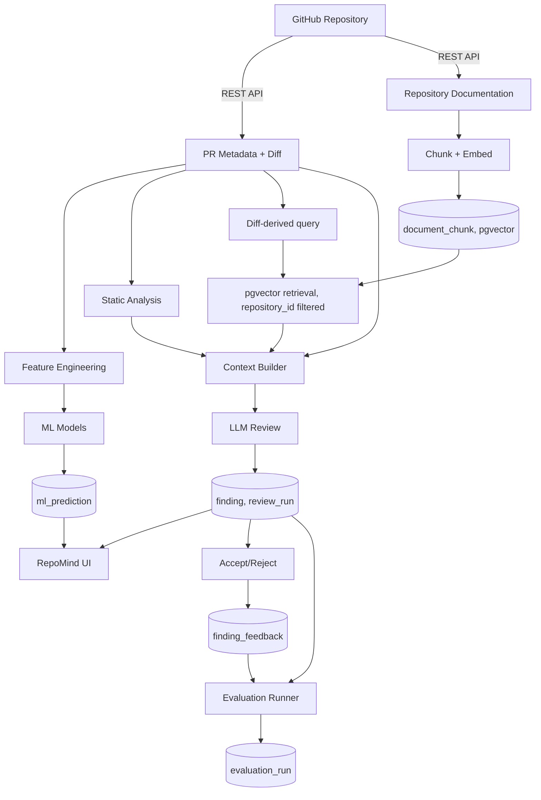

# Diagram — End-to-End Data Flow

**Status: Confirmed**

This diagram traces every data item from its GitHub source through to where it is stored and where it is surfaced in the UI, matching the module boundaries in `02-architecture/system-architecture.md`.
