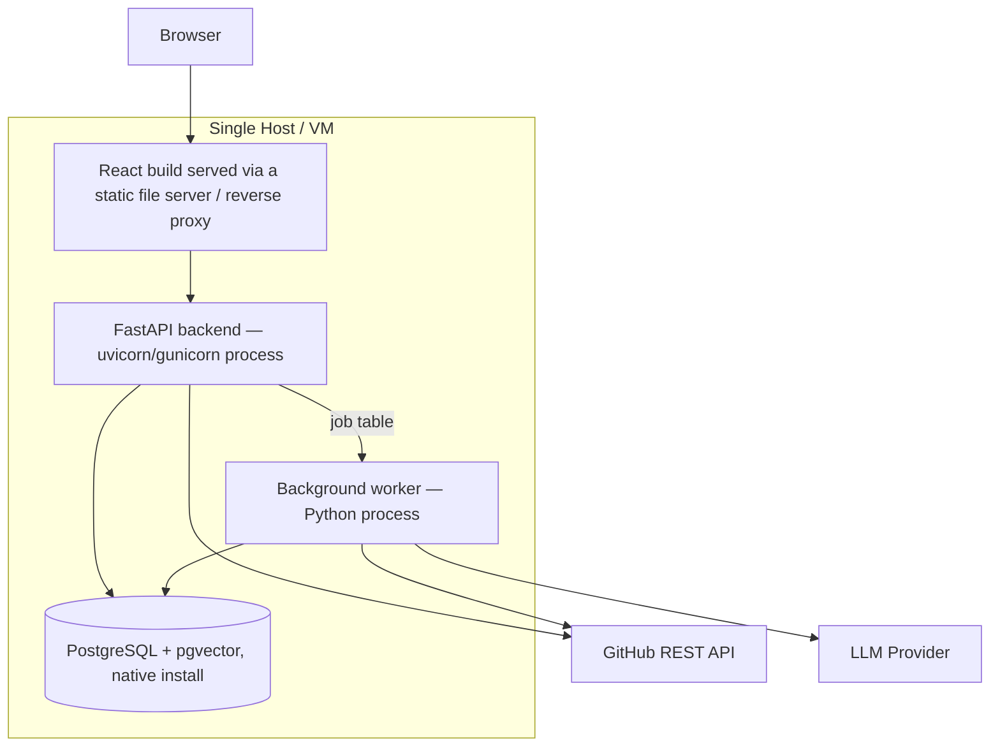

# Diagram — Deployment Architecture (Native, No Docker)

**Status: Proposed** (the source materials specify Docker Compose for deployment; this diagram reflects the project-owner's explicit native-deployment override — see `01-project/scope.md` and `07-deployment/deployment-guide.md`)

No Kubernetes and no container orchestration — no component here has an independent-scaling profile that justifies it. All processes run natively on one host (a developer machine for local development, or a single small VM for staging/production), managed by a process manager (see `07-deployment/deployment-guide.md`).
