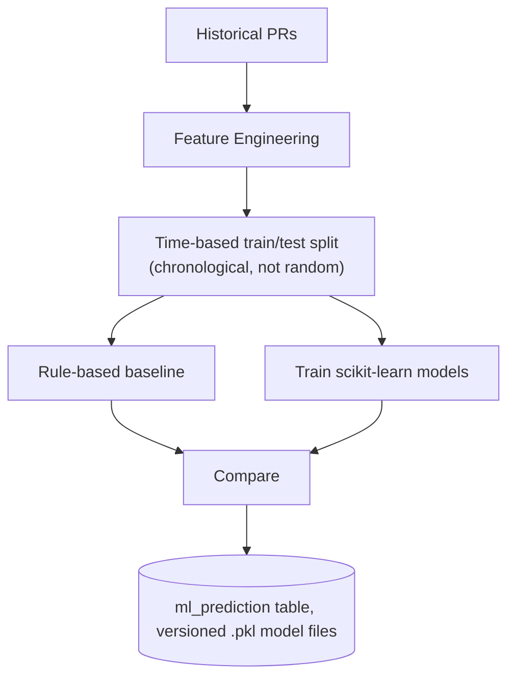

# Diagram — ML Pipeline

**Status: Confirmed**

- **Regression (cycle time):** Linear Regression → Random Forest → Gradient Boosting, evaluated by MAE/RMSE.
- **Classification (delay):** Logistic Regression → Random Forest, evaluated by Precision/Recall/F1/ROC-AUC.
- **Leakage prevention:** only features knowable at PR-open time are used (no final review count, no `merged_at`); the train/test split is chronological, not random.
- **Inference:** synchronous, fast (<100ms), loaded from versioned `.pkl` files, called from `review_service` alongside the AI review — not a separate serving system.
