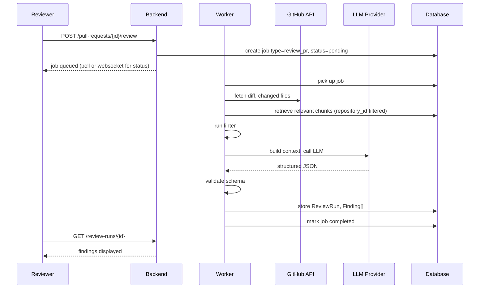
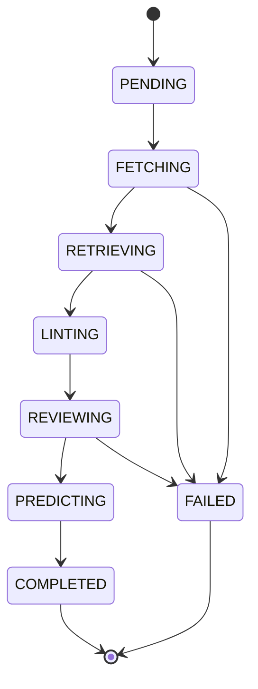

# Diagram — PR Review Sequence

**Status: Confirmed**



## Job State Machine



## Re-analysis Sequence

```mermaid
sequenceDiagram
    participant Dev as Developer
    participant GH as GitHub
    participant API as Backend
    participant W as Worker
    Dev->>GH: push new commit
    Note over API: Current phase — manual re-trigger;<br/>Future — webhook auto-fires
    API->>W: create job type=review_pr (new commit_sha)
    W->>W: re-run full pipeline
    W->>W: diff findings vs. previous run: NEW / PERSISTENT / RESOLVED
```
