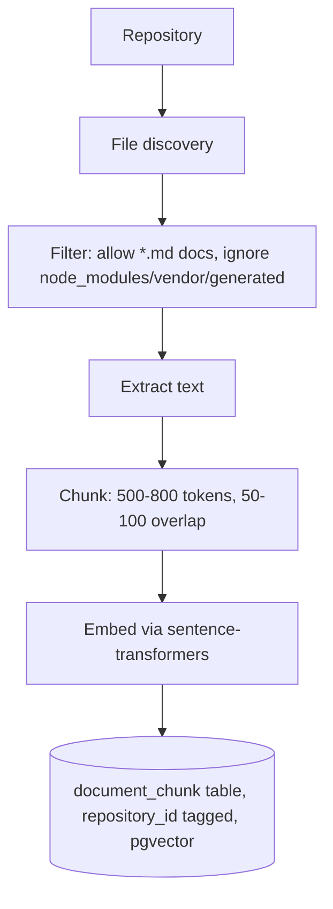

# Diagram — RAG Pipeline

**Status: Confirmed**

## Indexing



## Retrieval

```mermaid
flowchart LR
    Diff[PR Diff] --> Query[Derive query from changed files + summary]
    Query --> QEmbed[Embed query]
    QEmbed --> Search["pgvector cosine similarity\nWHERE repository_id = :id"]
    Search --> TopK[Top-k (3-5) chunks]
    TopK --> Context[Passed to context builder\nwith source citations preserved]
```

Re-indexing is triggered only when a document's content hash changes, not on every PR, avoiding re-embedding unchanged docs. Repository isolation is enforced at the query level, not assumed from separate embedding runs — see `06-testing/test-cases.md`, TC-011.
