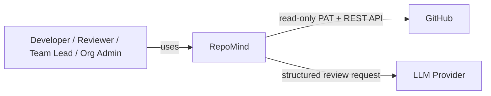

# Diagram — System Context

**Status: Confirmed**

Only two external systems exist in the current scope: GitHub (source of PRs, diffs, and repository documentation) and the configured LLM provider (Claude API by default). A Team Lead or Org Admin is a role within RepoMind, not a separate external system.
