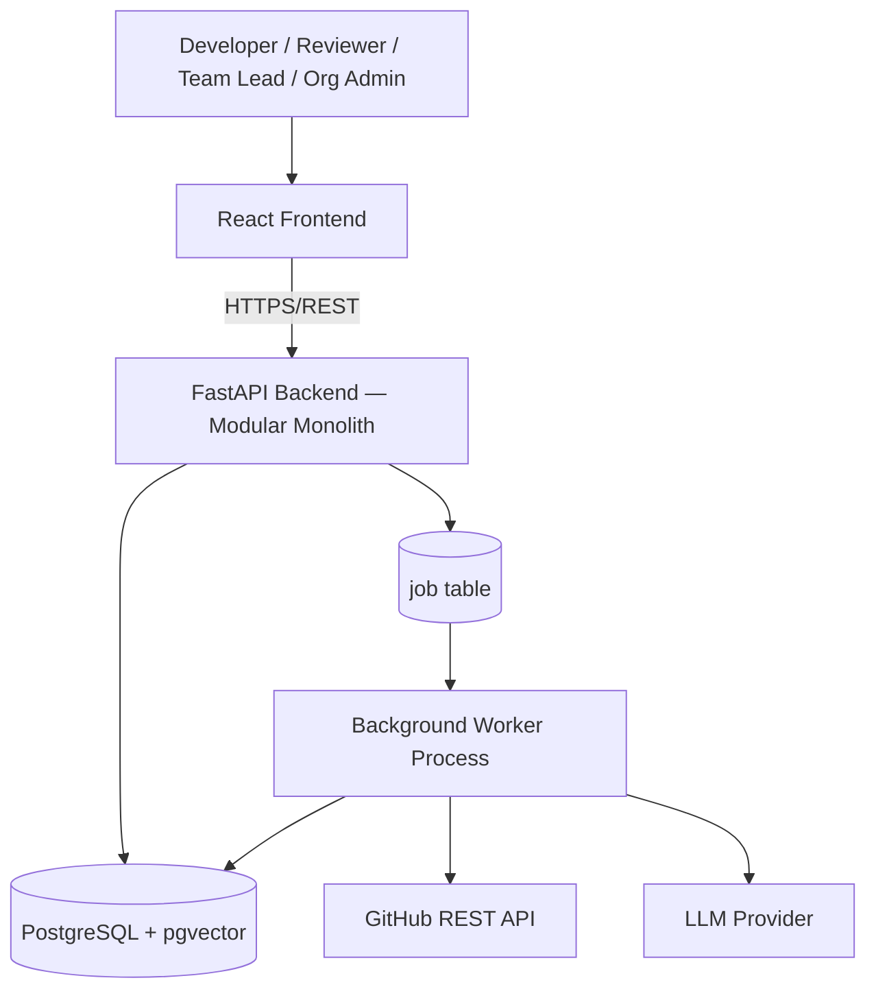
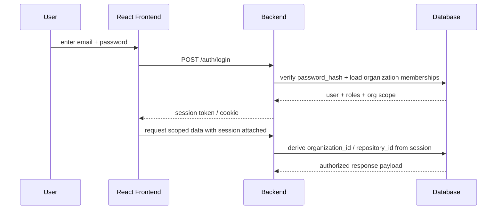
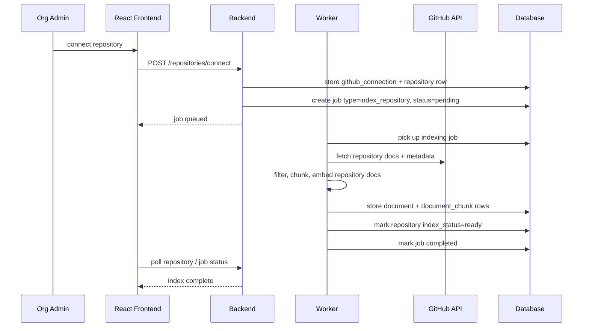
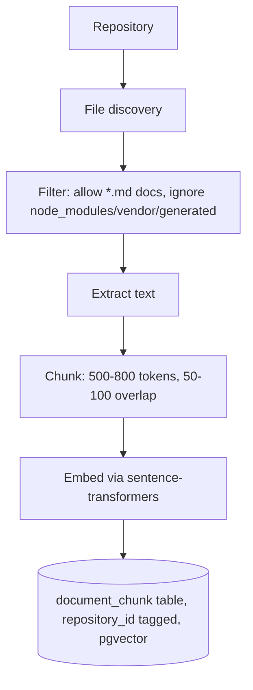
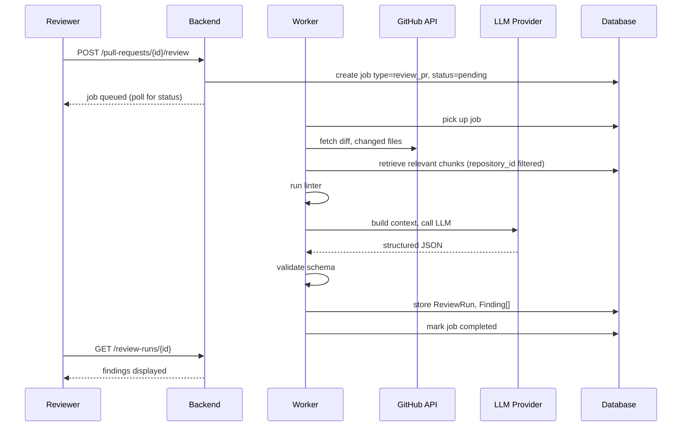
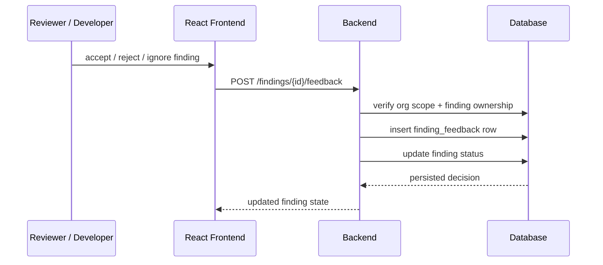
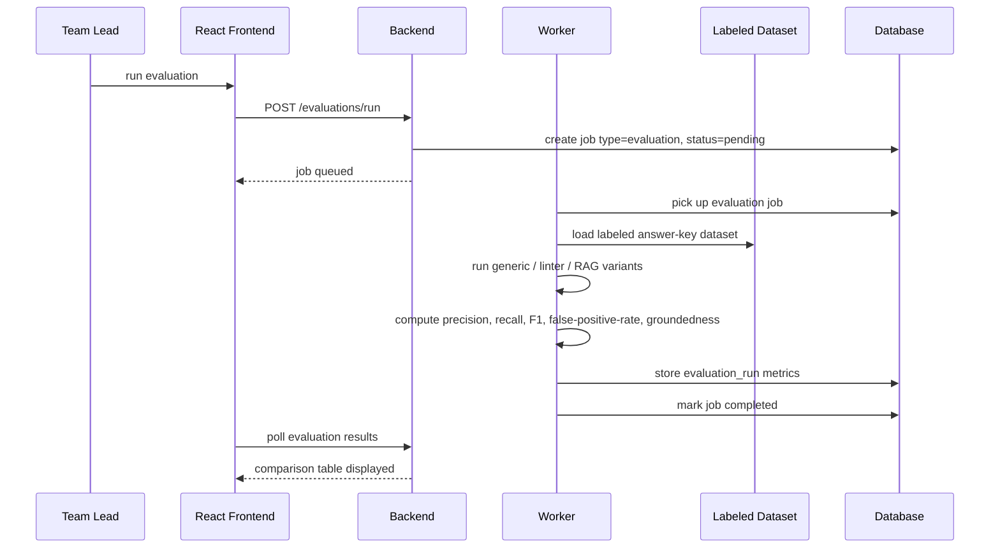

# RepoMind — System Architecture

**Status: Confirmed**

## Overall Architecture

RepoMind is a **modular monolith with a background worker tier**. It is one deploy target, built and operated by one team, with no component requiring independent scaling — except long-running AI calls (GitHub fetch, embedding, LLM calls), which run in a separate worker *process* so they never block the API. This is a process boundary, not a service boundary: there is no microservices decomposition, no message broker, and no container orchestration.

Why a modular monolith and not microservices: RepoMind has one deploy target, one team, and no component with an independent scaling profile. A module boundary is not, by itself, a reason to run a separate service.

## Frontend

React + TypeScript + Tailwind CSS single-page application, 9 routes (see `03-design/ui-design.md`). Server state (projects, repos, PRs, findings) is managed with React Query (or equivalent fetch+cache); no global state library — nothing in the app requires cross-cutting client state beyond what the router and query cache already provide.

## Backend

FastAPI + Pydantic, organized as internal modules with a strict, one-way dependency direction:

| Module | Responsibility | Depends on |
|---|---|---|
| `auth` | Login, sessions, org membership | — |
| `organizations` | Org/Project/Repository hierarchy | `auth` |
| `github` | GitHub API client, PR/doc/diff fetch | `organizations` |
| `rag` | Chunk, embed, retrieve — strictly repository-scoped | `github` |
| `linter` | Static analysis orchestration | `github` |
| `review` | Build LLM context, call LLM, validate output | `rag`, `linter`, `github` |
| `ml` | Feature extraction, cycle-time/delay models | `github` |
| `evaluation` | 3-way comparison, ML baseline comparison | `review`, `ml` |
| `feedback` | Accept/reject/ignore per finding | `review` |
| `audit` | Log sensitive actions | all modules |

`github` has zero AI dependencies — it is a pure adapter. `evaluation` is a leaf: nothing depends on it, and it is kept logically separate from production inference (see the RAG/AI pipeline diagrams).

## AI Layer

The AI layer combines three inputs — the PR diff, retrieved repository-rule chunks, and linter output — into a single LLM call that returns structured JSON findings. See `02-architecture/diagrams/ai-review-pipeline.md` for the full flow, and `03-design/api-design.md` for the finding schema.

## ML Layer

A classical ML pipeline (scikit-learn) predicts PR cycle time (regression) and delay probability (classification) from PR metadata, benchmarked against rule-based baselines. Inference is synchronous, fast (<100ms), and loads versioned `.pkl` model files — it is not a separate serving system. See `02-architecture/diagrams/ml-pipeline.md`.

## GitHub Integration

Phase 1 (current): read-only Personal Access Token + GitHub REST API, manually triggered. Phase 2 (future): a GitHub Actions workflow bridge. Phase 3 (future, deferred): a full GitHub App with webhooks. See `01-project/scope.md`.

## Authentication Flow

The session is the source of truth for authorization scope. Every subsequent request is checked against organization membership and role before any repository or review data is returned.

## Repository Onboarding / Indexing Flow

Repository indexing is asynchronous so the UI never blocks on GitHub fetches or embedding work. The repository stays in a pending/indexing state until the worker finishes persisting the chunks.

## Linter / Static-Analysis Integration

Language detection via file extension selects the tool set (currently ruff + bandit for Python, plus pytest results where applicable). Linter findings are stored and displayed **separately tagged** from LLM findings (`source: static_analysis` vs `source: llm`) — never merged into one undifferentiated list.

## Database

PostgreSQL is the single data store for relational data (users, orgs, projects, repos, PRs, findings, jobs, etc.) **and** for embedding storage/search via the `pgvector` extension — no separate vector database service. See `03-design/database-design.md`.

## Background Processing

A `job` table (statuses: `pending`/`running`/`completed`/`failed`/`cancelled`) acts as the queue; a polling worker process picks up jobs (repository indexing, PR review, evaluation runs) and executes the AI pipeline. No Celery, no Redis, no message broker — justified only if job volume grows substantially in the future.

## RAG Pipeline

Retrieval: diff → derived query → embed → `pgvector` cosine similarity, **filtered by `repository_id` on every query** → top-k (3–5) → passed to the context builder with source citations preserved. Re-indexing is triggered when a document's content hash changes, not on every PR. See `02-architecture/diagrams/rag-pipeline.md`.

## API Communication

Frontend ↔ backend communication is HTTPS/REST with session-based authentication. See `03-design/api-design.md` for the endpoint list.

## Data Flow

See `02-architecture/diagrams/data-flow.md` for the end-to-end data flow from GitHub through RAG/ML/LLM to stored findings and predictions.

## PR Review Flow

See `02-architecture/diagrams/pr-review-sequence.md` for the full-detail version, including the job state machine.

## Feedback Flow

Feedback is append-only at the audit/history level. A user's decision is stored separately from the finding itself so review history remains reproducible over time.

## Evaluation Flow

Kept logically separate from production inference: an evaluation run reads a labeled answer-key dataset, runs the three review configurations (generic LLM / LLM+linter / LLM+linter+RAG), and stores precision/recall/F1/false-positive-rate/groundedness against a versioned config in `evaluation_run`. Evaluation is triggered manually (never automatically mixed into production review traffic), so an uncontrolled prompt change cannot silently alter what an evaluation run measures. See `02-architecture/diagrams/ai-review-pipeline.md`.
