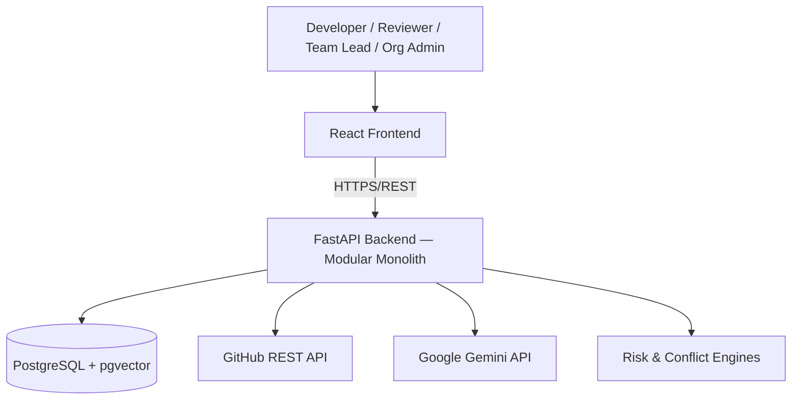
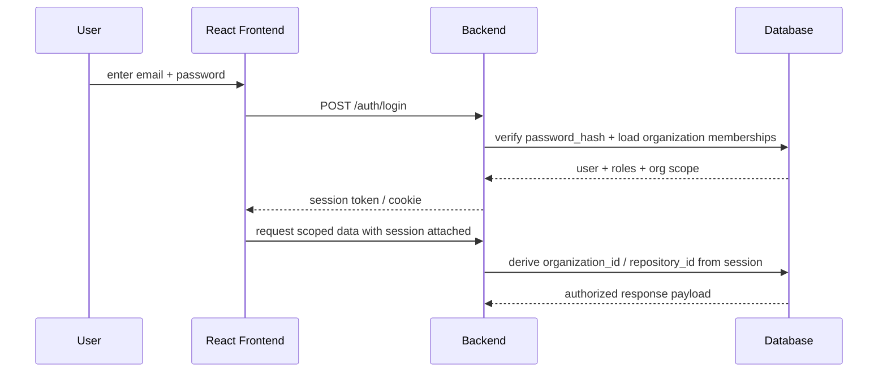
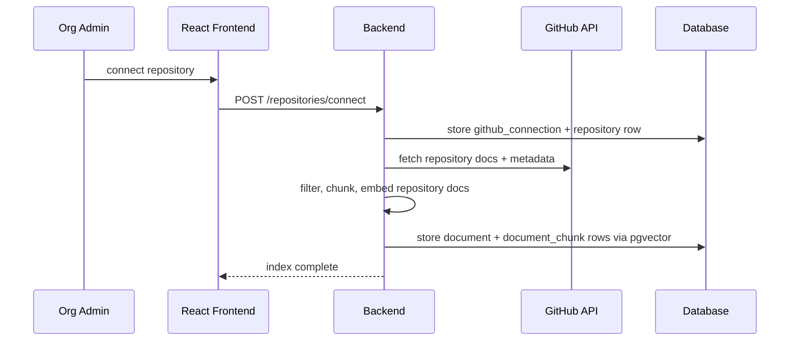
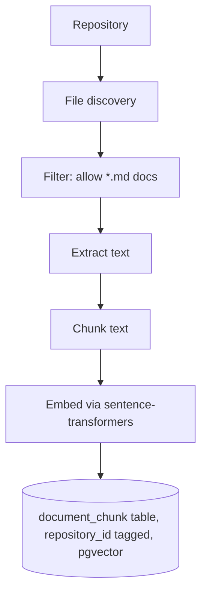
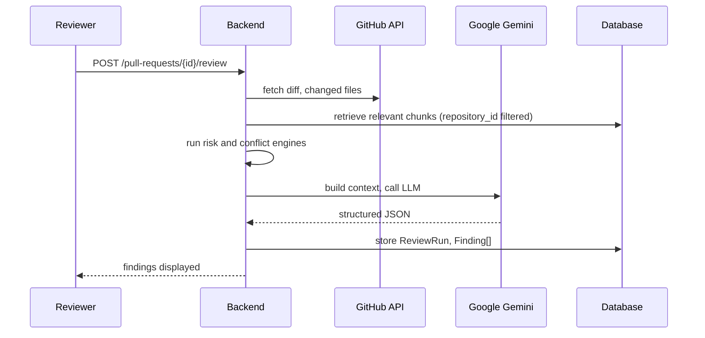

# RepoMind 2.0 — System Architecture

**Status: Completed**

## Overall Architecture

RepoMind 2.0 is a **modular monolith**. It is designed to be run natively on bare-metal or VMs using Python Virtual Environments (NO Docker). 

## Frontend

React + Vite + TailwindCSS (v3.4.0) single-page application. Features a premium dark-mode glassmorphism aesthetic. Server state is managed with TanStack Query. 
Core views: Dashboard, Repositories, PRs, Security Browser, Settings, and Review UI.

## Backend

FastAPI + Pydantic, organized as internal modules:

| Module | Responsibility | Depends on |
|---|---|---|
| `auth` | Login, sessions, org membership | — |
| `organizations` | Org/Project/Repository hierarchy | `auth` |
| `github` | GitHub API client, PR/doc/diff fetch | `organizations` |
| `rag` | Chunk, embed, retrieve via pgvector | `github` |
| `review` | Build Gemini context, run engines, validate output | `rag`, `github` |
| `chat` | Manage AI conversational sessions | `rag`, `github` |
| `risk` | Compute logical complexity score | `github` |
| `conflicts` | Detect cross-PR merge conflicts | `github` |

## AI Layer

The AI layer is exclusively powered by Google Gemini (`google-genai` SDK) and Code-Aware RAG.
There are no local ML models or complex ML training pipelines. The LLM handles structure findings and real-time chat, strictly grounded in repository rules.

## Authentication Flow

## Repository Onboarding / Indexing Flow

## Database

PostgreSQL is the single data store for relational data **and** for embedding storage/search via the natively installed `pgvector` extension. 

## RAG Pipeline

Retrieval: diff/chat query → embed → `pgvector` cosine similarity, **filtered by `repository_id` on every query** → top-k → passed to Gemini.

## API Communication

Frontend ↔ backend communication is HTTPS/REST with session-based authentication.

## PR Review Flow

