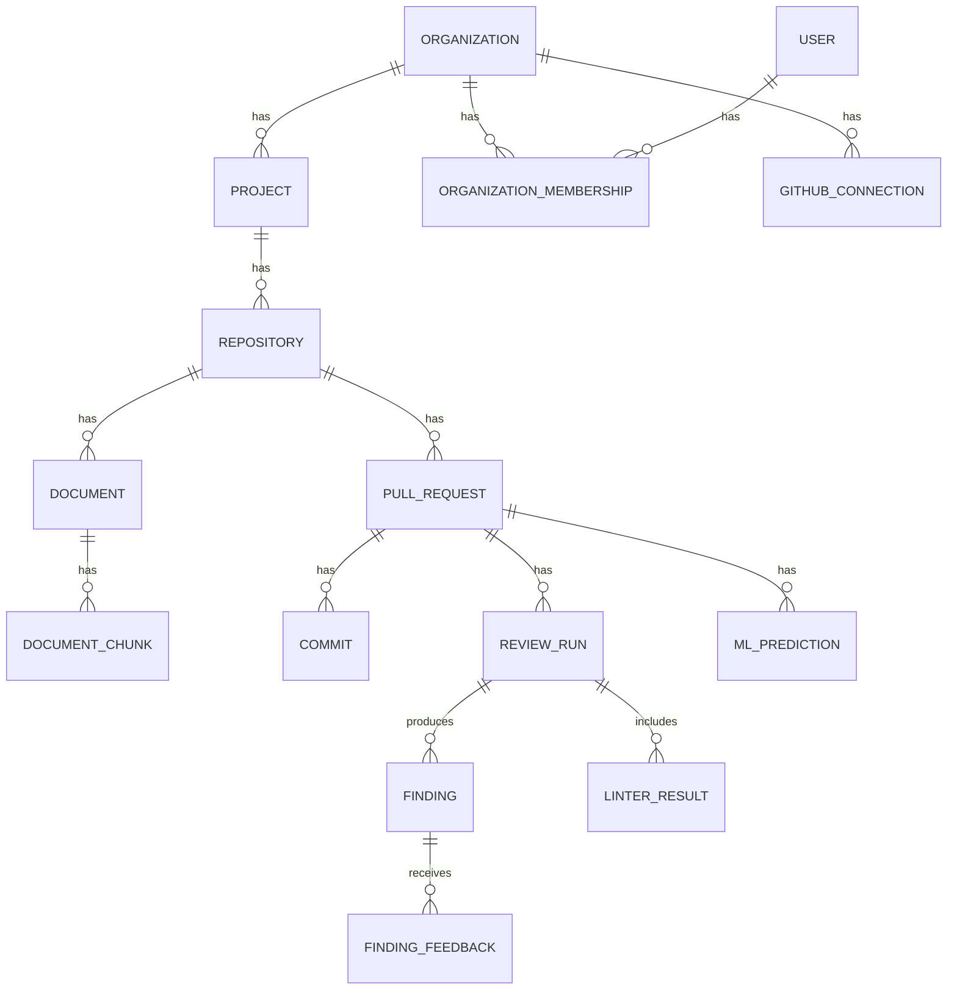

# RepoMind — Database Design

**Status: Confirmed** (schema and migration plan per the Implementation Blueprint, Part 7)

## Database Technology

PostgreSQL, with the `pgvector` extension enabled for embedding storage and cosine-similarity search within `document_chunk`. No separate vector database service (see ADR-005).

## Entities

| Table | Key Columns | Notes |
|---|---|---|
| `user` | `id`, `email`, `password_hash`, `created_at` | |
| `organization` | `id`, `name`, `created_at` | Tenant boundary |
| `organization_membership` | `id`, `user_id` (FK), `organization_id` (FK), `role` (enum: `developer`/`reviewer`/`team_lead`/`org_admin`) | |
| `project` | `id`, `organization_id` (FK), `name` | |
| `repository` | `id`, `project_id` (FK), `github_owner`, `github_name`, `default_branch`, `index_status`, `last_indexed_at` | |
| `github_connection` | `id`, `organization_id` (FK), `encrypted_token`, `scope`, `created_at` | One per org (or per repo, depending on token scoping needs) |
| `pull_request` | `id`, `repository_id` (FK), `github_number`, `title`, `author`, `state`, `created_at`, `merged_at`, `additions`, `deletions`, `files_changed` | |
| `commit` | `id`, `pull_request_id` (FK), `sha`, `created_at` | Used for re-analysis diffing |
| `document` | `id`, `repository_id` (FK), `path`, `content_hash`, `updated_at` | |
| `document_chunk` | `id`, `document_id` (FK), **`repository_id` (FK, denormalized for isolation)**, `text`, `embedding` (vector), `chunk_index` | `repository_id` is present directly on this table so every retrieval query filters on it without a join |
| `review_run` | `id`, `pull_request_id` (FK), `commit_sha`, `status` (enum), `repomind_version`, `prompt_version`, `llm_model`, `rag_enabled` (bool), `started_at`, `completed_at` | |
| `finding` | `id`, `review_run_id` (FK), `type` (enum), `severity` (enum), `file`, `line`, `title`, `explanation`, `rule_source`, `recommendation`, `confidence`, `status` (enum: `open`/`accepted`/`rejected`/`resolved`) | |
| `finding_feedback` | `id`, `finding_id` (FK), `user_id` (FK), `decision` (enum), `reason`, `created_at` | Append-only |
| `linter_result` | `id`, `review_run_id` (FK), `tool`, `raw_output` (json) | |
| `ml_prediction` | `id`, `pull_request_id` (FK), `model_version`, `predicted_cycle_time_hours`, `delay_probability`, `created_at` | |
| `evaluation_run` | `id`, `run_at`, `config` (json: variant, dataset_version), `precision`, `recall`, `f1`, `false_positive_rate`, `groundedness` | |
| `job` | `id`, `type`, `status` (enum: `pending`/`running`/`completed`/`failed`/`cancelled`), `payload` (json), `result` (json), `retries`, `created_at`, `updated_at` | The background job "queue" |
| `audit_log` | `id`, `user_id` (FK), `action`, `target_type`, `target_id`, `created_at` | |

**Deliberately absent (per explicit project decision, not an oversight):** `developer_score`, `notification`, `task`, `comment_thread` — none serve a confirmed requirement, and `developer_score` specifically is excluded to prevent individual performance scoring (see `01-project/requirements.md`, NFR-010, and `05-security/security.md`).

## Relationships (ER Diagram)

## Primary / Foreign Keys and Constraints

- All tables use a surrogate primary key `id`.
- `organization_membership.user_id` → `user.id`; `organization_membership.organization_id` → `organization.id`.
- `project.organization_id` → `organization.id`.
- `repository.project_id` → `project.id`.
- `document.repository_id` → `repository.id`; `document_chunk.document_id` → `document.id`; `document_chunk.repository_id` → `repository.id` (denormalized, see below).
- `pull_request.repository_id` → `repository.id`; `commit.pull_request_id` → `pull_request.id`.
- `review_run.pull_request_id` → `pull_request.id`; `finding.review_run_id` → `review_run.id`; `linter_result.review_run_id` → `review_run.id`.
- `finding_feedback.finding_id` → `finding.id`; `finding_feedback.user_id` → `user.id`.
- `ml_prediction.pull_request_id` → `pull_request.id`.
- `audit_log.user_id` → `user.id`.

## Repository / Project Isolation

`document_chunk.repository_id` is intentionally denormalized (present directly on the chunk row, not reached only via a join through `document`) so that every retrieval query can filter on it directly: `WHERE repository_id = :id`. This is the enforcement point for the confirmed repository-isolation requirement (`01-project/requirements.md`, FR-011a) and is covered by an automated test (`06-testing/test-cases.md`, TC-011). More broadly, every API query is scoped by `organization_id`/`repository_id` derived from the authenticated session (see `05-security/security.md`).

## Indexing Strategy

- Standard B-tree indexes on all foreign keys (`repository_id`, `project_id`, `pull_request_id`, `review_run_id`, `finding_id`, etc.) to support the scoped-query pattern above.
- A vector index (via `pgvector`, e.g. an IVFFlat or HNSW index depending on `pgvector` version available at implementation time) on `document_chunk.embedding` to support efficient cosine-similarity search — exact index type is an implementation detail to be selected during Phase 6/7 based on chunk volume; not specified in the source materials, so treated as **Proposed**.
- `job.status` should be indexed to support efficient polling by the worker process.

## Review / Finding Relationships

A `pull_request` can have many `review_run`s (one per analysis, including re-analyses on new commits). Each `review_run` produces many `finding`s and `linter_result`s. Each `finding` can receive many `finding_feedback` rows over time (append-only — feedback is never overwritten, only added), allowing a full history of who accepted/rejected/ignored a finding and when.

## Evaluation Data

`evaluation_run` stores one row per evaluation execution, with a `config` JSON field recording the variant (generic / linter / RAG), dataset version, and other reproducibility parameters, alongside the resulting precision/recall/F1/false-positive-rate/groundedness scores. This table is intentionally separate from `review_run`/`finding` — evaluation results never mix with production review data.

## ML Prediction Data

`ml_prediction` stores one row per PR per prediction (cycle time, delay probability), tagged with `model_version` so predictions remain interpretable as the models are retrained over time.

## Audit Information

`audit_log` records sensitive actions (GitHub connection changes, org membership changes, feedback actions, evaluation runs) per the security requirements in `05-security/security.md`. This table is added in migration 010, during the security-hardening phase.

## Migration Plan

| Migration | Adds | Introduced In |
|---|---|---|
| 001 | `user`, `organization`, `organization_membership` | Phase 3 (Authentication) |
| 002 | `project`, `repository`, `github_connection` | Phase 4 (Org/Project/Repository) |
| 003 | `pull_request`, `commit` | Phase 5 (GitHub integration) |
| 004 | `document`, `document_chunk` (+ `pgvector` extension) | Phase 6–7 (Indexing + RAG) |
| 005 | `review_run`, `finding`, `linter_result` | Phase 8–9 (LLM review + static analysis) |
| 006 | `finding_feedback` | Phase 12 (Feedback) |
| 007 | `job` | Phase 13 (Background jobs / re-analysis) |
| 008 | `ml_prediction` | Phase 15 (ML risk prediction) |
| 009 | `evaluation_run` | Phase 14 (Evaluation) |
| 010 | `audit_log` | Phase 17 (Security hardening) |

See `07-deployment/database-migrations.md` for the operational Alembic workflow.

## Schema Status

- **Current schema:** the 17 tables listed above, introduced across migrations 001–010, as described in `01-project/implementation-plan.md`.
- **Planned schema:** none beyond the above within the current phase.
- **Future schema:** any table needed for team/repository analytics (P2, deferred) would be additive and is not yet designed; it must not introduce individual-level scoring per NFR-010.
