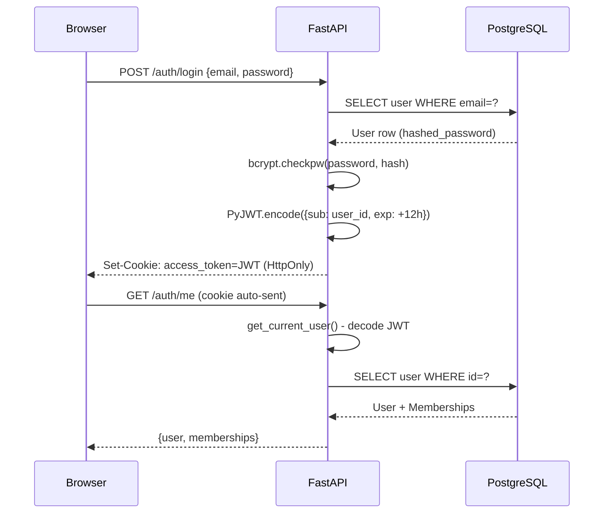

# 02 — Feature Flow: Authentication

## Feature Summary
Users register and log in to obtain a session. The session is maintained via an **HttpOnly cookie** containing a **JWT (HS256)**. All subsequent API calls carry this cookie automatically. Password hashing uses **bcrypt (12 rounds)**. RBAC is enforced per-endpoint via FastAPI dependency injection.

---

## End-to-End Flow

### 1. Registration

| Step | Where | What Happens |
|---|---|---|
| User submits email + password + org_name | `LoginPage.jsx` | `authApi.register()` called |
| `authApi.register()` | `frontend/src/lib/api.js:39` | `POST /auth/register` with `{email, password, organization_name}` |
| Route handler | `backend/app/auth/router.py` | `POST /auth/register` → calls `auth_service.register_user()` |
| Service | `backend/app/auth/service.py` → `register_user()` | Hash password with `bcrypt.hashpw(rounds=12)`, create `User` row, create `Organization` row, create `OrgMembership` row with `role='org_admin'` |
| DB writes | `user`, `organization`, `org_membership` tables | via `db.add()` + `db.commit()` |
| Response | `backend/app/auth/schemas.py` | Returns `UserResponse` + `MembershipResponse` list |
| Cookie set | `backend/app/auth/router.py` | `response.set_cookie(key="access_token", value=jwt_token, httponly=True, secure=False, samesite="lax")` |
| Frontend | `App.jsx:handleLoginSuccess()` | Stores `currentUser` and `memberships` in React state |

### 2. Login

| Step | Where | What Happens |
|---|---|---|
| User submits email + password | `LoginPage.jsx` | `authApi.login(email, password)` |
| API call | `frontend/src/lib/api.js:34` | `POST /auth/login` with `{email, password}` |
| Route | `backend/app/auth/router.py` → `POST /auth/login` | Calls `auth_service.authenticate_user()` |
| Service | `backend/app/auth/service.py` → `authenticate_user()` | `db.query(User).filter_by(email=email)`, then `bcrypt.checkpw(password, stored_hash)` |
| JWT generation | `backend/app/auth/service.py` → `create_access_token()` | `PyJWT.encode({sub: user_id, exp: now+12h}, JWT_SECRET, algorithm="HS256")` |
| Cookie set | `backend/app/auth/router.py` | `response.set_cookie(key="access_token", httponly=True, value=token)` |
| Memberships | `backend/app/auth/service.py` | Query `OrgMembership` by `user_id`, return with response |
| Frontend update | `App.jsx:65-68` | `setCurrentUser(data.user)`, `setMemberships(data.memberships)` |

### 3. Session Restoration (Page Reload)

| Step | Where | What Happens |
|---|---|---|
| `App.jsx` mount | `App.jsx:42-63` | `useEffect(() => checkSession())` |
| `checkSession()` | `App.jsx:46` | Calls `authApi.getMe()` |
| API call | `frontend/src/lib/api.js:48` | `GET /auth/me`, cookie auto-sent by browser |
| Route | `backend/app/auth/router.py` → `GET /auth/me` | Calls `get_current_user` dependency |
| Dependency | `backend/app/auth/dependencies.py` → `get_current_user()` | Reads `access_token` cookie, decodes JWT, fetches `User` from DB |
| Response | Router returns | `{user: {...}, memberships: [...]}` |

### 4. Logout

| Step | Where | What Happens |
|---|---|---|
| User clicks logout | `AppLayout.jsx` | Calls `authApi.logout()` then `props.onLogout()` |
| API call | `lib/api.js:44` | `POST /auth/logout` |
| Route | `backend/app/auth/router.py` | `response.delete_cookie("access_token")` |
| Frontend | `App.jsx:70-73` | `setCurrentUser(null)`, `setMemberships([])` → renders `<LoginPage>` |

---

## RBAC Enforcement

### Backend (Canonical)
File: `backend/app/auth/permissions.py`

```
RoleEnum:
  developer
  reviewer
  tech_lead (alias: team_lead)
  org_admin

Permission enum includes:
  organization.read / update
  members.read / invite / update / remove
  projects.read / create / update / delete
  repositories.read / connect / update / delete / index
  prs.read / review / approve / request_changes
  findings.read / dismiss / feedback
  reviews.run / read
  analytics.read / security.read / audit.read
  policies.read / update
  chat.use

ROLE_PERMISSIONS map (dict[RoleEnum, set[Permission]]):
  developer: {organization.read, members.read, projects.read, repositories.read,
              prs.read, findings.read, reviews.read, reviews.run, analytics.read,
              security.read, findings.feedback, chat.use, policies.read}
  reviewer: developer + {prs.review, prs.request_changes, findings.dismiss}
  tech_lead: reviewer + {prs.approve, repositories.index}
  org_admin: tech_lead + all admin permissions
```

Dependency factories in `permissions.py`:
- `require_permission(Permission.X)` — raises `HTTP 403` if user lacks permission
- `require_org_permission(Permission.X)` — org-scoped version

### Frontend (Mirror)
File: `frontend/src/hooks/usePermissions.js`

```javascript
usePermissions(memberships, orgId)
  -> { can(permission), hasRole(role), isOrgAdmin, isLead, isReviewer, isDeveloper }
```

Permissions are encoded as string constants in `Permissions` object matching the backend enum strings exactly. Routes in `App.jsx` use `<ProtectedRoute requiredPermission={Permissions.X}>` which renders "Access Denied" if `can(permission)` returns false.

---

## Key Files

| File | Location | Role |
|---|---|---|
| `router.py` | `backend/app/auth/router.py` | FastAPI routes: `/auth/register`, `/auth/login`, `/auth/logout`, `/auth/me` |
| `service.py` | `backend/app/auth/service.py` | `register_user()`, `authenticate_user()`, `create_access_token()` |
| `models.py` | `backend/app/auth/models.py` | `User`, `OrgMembership` SQLAlchemy models |
| `dependencies.py` | `backend/app/auth/dependencies.py` | `get_current_user()` FastAPI dependency (reads cookie, decodes JWT) |
| `permissions.py` | `backend/app/auth/permissions.py` | `Permission` enum, `ROLE_PERMISSIONS`, `require_permission()` factory |
| `schemas.py` | `backend/app/auth/schemas.py` | Pydantic request/response schemas |
| `api.js` (auth) | `frontend/src/lib/api.js:33-52` | `authApi.login/register/logout/getMe` |
| `usePermissions.js` | `frontend/src/hooks/usePermissions.js` | `Permissions` constants + `usePermissions()` hook |
| `App.jsx` | `frontend/src/App.jsx` | `checkSession()`, `handleLoginSuccess()`, `<ProtectedRoute>` |

---

## Data Flow Diagram (Mermaid)



---

## Security Properties

| Property | Implementation |
|---|---|
| Password storage | bcrypt hash, 12 rounds, never stored plaintext |
| Session token | JWT HS256, 12-hour expiry, stored in HttpOnly cookie |
| Cookie flags | `httponly=True`, `samesite='lax'`, HTTPS-ready |
| RBAC enforcement | Backend: FastAPI dependency injection per-route. Frontend: `<ProtectedRoute>` guard |
| Token transmission | Browser auto-sends cookie — no JS access to token value |
