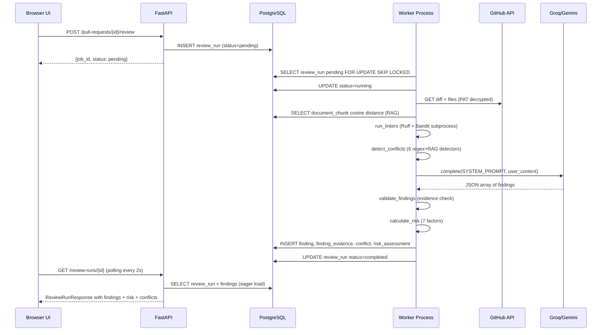

# 05 — Feature Flow: PR Review Pipeline (Full 11-Stage)

## Feature Summary
The PR review pipeline is the core of RepoMind 2.0. It is triggered either by a user clicking "Review" in the UI or automatically by a GitHub webhook. The pipeline runs asynchronously in the background worker and executes 11 distinct stages. The result is a completed `ReviewRun` with validated `Finding` records, `Conflict` records, a `RiskAssessment`, and `FindingEvidence` backing each finding.

---

## Trigger Paths

```
PATH 1: Manual Trigger (User)
  User clicks "Review" on ReviewPage
      -> reviewApi.triggerReview(prId)
      -> POST /pull-requests/{prId}/review
      -> review/router.py: creates ReviewRun(status='pending')
      -> Worker picks up within 5s

PATH 2: Automatic Trigger (GitHub Webhook)
  GitHub sends pull_request.opened / synchronize / reopened
      -> POST /webhooks/github (HMAC verified)
      -> webhooks/routes.py: _enqueue_review()
      -> Creates ReviewRun(status='pending')
      -> Worker picks up within 5s
```

---

## Worker Execution

File: `worker/worker.py` → `_process_one_job(provider)`

```
SELECT review_run WHERE status='pending'
FOR UPDATE SKIP LOCKED
ORDER BY id ASC
LIMIT 1

  -> mark status='running', commit (claim the job)
  -> resolve PR -> Repository -> Project -> organization_id
  -> call run_review(db, pull_request_id, organization_id, provider)
```

---

## Review Pipeline: 11 Stages

File: `backend/app/review/service.py` → `run_review()`

### Stage 1: Resolve PR + Repository (DB Authoritative)

```python
pr = db.get(PullRequest, pull_request_id)
repo = get_repository_by_id(db, pr.repository_id)
repository_id = pr.repository_id   # NEVER from external param
```

Security invariant: `repository_id` is derived exclusively from the DB relationship, never from any client-supplied parameter.

---

### Stage 2: Create ReviewRun (pending → running)

```python
run = ReviewRun(
    pull_request_id=pull_request_id,
    commit_sha=pr.head_sha,
    status="running",
    repomind_version=REPOMIND_VERSION,   # "0.8.0"
    prompt_version=PROMPT_VERSION,        # "p8-v1"
    llm_model=type(provider).__name__,
    rag_enabled=True,
    intelligence_mode="v1",
    started_at=datetime.now(timezone.utc),
    progress_message="Fetching PR data from GitHub...",
)
db.add(run)
db.flush()   # Get run.id
```

Progress updates (`run.progress_message`) are committed after each stage for UI polling.

---

### Stage 3: Fetch PR Diff + Changed Files

```python
pat = get_decrypted_pat_for_org(db, organization_id)
client = GitHubClient(pat)

# Unified diff
diff = client.get_pull_request_diff(owner, repo_name, pr.github_number)

# File list (for blast radius + conflict analysis)
pr_files_raw = client.get_pull_request_files(owner, repo_name, pr.github_number)
changed_files = [f["filename"] for f in pr_files_raw]
pr_additions = sum(f["additions"] for f in pr_files_raw)
pr_deletions = sum(f["deletions"] for f in pr_files_raw)
```

If GitHub API fails: `_mark_failed(db, run)` and return.

Diff truncated to `settings.MAX_DIFF_CHARS` to avoid LLM token overflow.

---

### Stage 4: Retrieve RAG Context

```python
query = derive_query_from_diff(pr_title=pr.title, diff=diff)
retriever = RAGRetriever(db=db, embedder=embedder)
retrieved_chunks = retrieve_context(
    retriever=retriever,
    repository_id=repository_id,    # DB-authoritative
    query=query,
    top_k=settings.RAG_MAX_CHUNKS,
)
```

`derive_query_from_diff()` (in `review/context.py`): extracts keywords from diff + title for the embedding query.

`retrieve_context()` (in `review/context.py`): calls `RAGRetriever.search()` → pgvector cosine distance query filtered by `repository_id`.

Returns a list of `RetrievalResult(text, path, chunk_type, distance, chunk_id)`.

---

### Stage 5: Run Static Analysis (Ruff + Bandit)

```python
run_linters(
    db=db,
    client=client,
    owner=repo.github_owner,
    repo=repo.github_name,
    pr_number=pr.github_number,
    review_run_id=run.id,
)
```

`run_linters()` in `backend/app/linter/service.py`:
1. `client.get_pull_request_files()` → filter for `.py` files not `removed`
2. For each file: `client.get_blob_content(sha)` → write to `tempfile.TemporaryDirectory()`
3. Fetch repo config files: `pyproject.toml`, `ruff.toml`, `.ruff.toml`, `bandit.yaml`, `.bandit`
4. `RuffLinter().execute(temp_dir, files)` → `subprocess.run(["ruff", "check", "--output-format", "json", ...], shell=False, timeout=30)`
5. `BanditLinter().execute(temp_dir, files)` → `subprocess.run(["bandit", "-f", "json", ...], shell=False, timeout=30)`
6. Persist `LinterResult` rows (JSONB `raw_output`)

Linter output truncated to `settings.MAX_LINTER_CHARS`.

---

### Stage 6: Detect Semantic + Mechanical Conflicts

```python
detected_conflicts = detect_conflicts(
    diff=diff,
    retrieved_chunks=retrieved_chunks,
    pr_title=pr.title,
    pr_description="",
    changed_files=changed_files,
)
_persist_conflicts(db, run, detected_conflicts)
```

`detect_conflicts()` in `backend/app/conflicts/engine.py` runs 6 detectors:

| Detector | What It Checks | Grounding |
|---|---|---|
| `_detect_mechanical_conflicts()` | Git merge markers (`<<<<<<<`, `=======`, `>>>>>>>`) in diff | Pure diff scan |
| `_detect_architecture_conflicts()` | Regex patterns (DB access in routers, global state) | Requires arch doc chunks in RAG |
| `_detect_security_policy_conflicts()` | Hardcoded secrets, SQL f-strings, new endpoints without auth | Regex + security doc chunks |
| `_detect_api_contract_conflicts()` | Fields removed from schema/model files | Regex diff analysis |
| `_detect_test_contract_conflicts()` | Source changed but no test files changed | RAG test docs required |
| `_detect_configuration_conflicts()` | Config files (`settings.py`, `.env`, etc.) modified | File name matching |

Results sorted by severity (critical → high → medium → low). Persisted to `conflict` table.

---

### Stage 7: Build Prompt + Call LLM (with Retry)

```python
user_content = build_user_content(
    pr_title=pr.title,
    diff=bounded_diff,
    retrieved_chunks=retrieved_chunks,
    linter_results_text=linter_results_text,
)

# Two-attempt loop
for attempt in (1, 2):
    system = SYSTEM_PROMPT if attempt == 1 else RETRY_SYSTEM_PROMPT
    raw_output = provider.complete(system_prompt=system, user_content=user_content)
    findings_raw = parse_llm_output(raw_output)   # raises LLMOutputParseError on bad JSON
    if success: break
    if attempt == 2: _mark_failed(); return
```

**System prompt** (`review/prompts.py` → `SYSTEM_PROMPT`): Fixed text. Never contains repo data. Instructs LLM to return JSON array of findings. Contains prompt-injection defense instruction.

**User content** (`build_user_content()`): PR title (labeled untrusted), bounded diff (labeled untrusted), RAG chunks (labeled untrusted), linter output (labeled untrusted).

**LLM Provider selection** (`review/provider.py` → `get_llm_provider(settings)`):
- `LLM_PROVIDER=groq` → `FallbackProvider(GroqProvider, GeminiProvider)` if both keys present
- `LLM_PROVIDER=gemini` → `GeminiProvider`
- Otherwise → `LocalProvider` (mock)

**Groq call** (`GroqProvider.complete()`):
```python
client = Groq(api_key=GROQ_API_KEY)
response = client.chat.completions.create(
    model=settings.GROQ_MODEL,
    messages=[
        {"role": "system", "content": system_prompt},
        {"role": "user", "content": user_content}
    ],
    temperature=0.2,
)
return response.choices[0].message.content
```

Retry: `tenacity` with exponential backoff (4s min, 60s max) on HTTP 429/500/502/503/504.

---

### Stage 8: Validate Evidence for Each Finding

```python
validated_findings = validate_findings(
    findings=findings_raw,
    retrieved_chunks=retrieved_chunks,
    linter_results=linter_results_raw,
    diff=diff,
)
```

`validate_findings()` in `backend/app/review/evidence.py`:

For each finding:
1. **RAG chunk support**: Find chunks whose text keyword-overlaps with the finding title+problem AND have cosine distance < 0.7. Classify as `strong` (< 0.4) or `weak` (< 0.7).
2. **Linter confirmation**: Find linter issues matching the same file basename and within 5 lines.
3. **Diff verification**: Check that the cited file appears in the diff (hallucination detection).

Evidence status assignment:
- `supported` + confidence boost (×1.1, capped at 1.0) if strong RAG/linter evidence
- `unverified` + confidence penalty (×0.8) if no evidence found
- `contradicted` + severe penalty (×0.3) if file not in diff

Returns `List[ValidatedFinding]` with `evidence_status`, `adjusted_confidence`, `supporting_evidence`, `contradicting_evidence`.

---

### Stage 9: Calculate PR Risk Score

```python
risk_result = calculate_risk(
    diff=diff,
    validated_findings=validated_findings,
    conflicts=detected_conflicts,
    linter_results=linter_results_raw,
    changed_files=changed_files,
    pr_title=pr.title,
    additions=pr_additions,
    deletions=pr_deletions,
)
_persist_risk(db, run, risk_result)
```

`calculate_risk()` in `backend/app/risk/engine.py` — 7 weighted factors:

| Factor | Weight | Scoring Signals |
|---|---|---|
| `security_exposure` | 25% | Critical/high security findings, security policy conflicts, sensitive file names |
| `code_complexity` | 20% | Total findings count, linter issue count, deep nesting in diff |
| `architecture_risk` | 15% | Architecture findings, api_contract conflicts |
| `test_risk` | 15% | Test contract conflicts, linter errors, source changed with no tests |
| `change_size` | 10% | Total additions + deletions |
| `dependency_risk` | 10% | `requirements.txt`, `package.json`, etc. changed |
| `blast_radius_factor` | 5% | Number of source files changed × heuristic multiplier |

Score range: 0–100. Level: `low` (0–25), `medium` (26–50), `high` (51–75), `critical` (76–100).

Persisted to `risk_assessment` table with `score`, `level`, `factors` (JSONB), `blast_radius` (JSONB), `test_impact` (JSONB), `summary`.

---

### Stage 10: Persist Validated Findings + Evidence

```python
_persist_validated_findings(db, run, validated_findings)
```

For each `ValidatedFinding`:
1. Look up previous completed `ReviewRun` for this PR
2. Compare with previous findings to determine `lifecycle_status`:
   - `new` — not seen before
   - `persistent` — same file + type + line (within 3) as previous run
   - `resolved` — in previous run but not in this run (carried over as resolved)
3. Create `Finding` row
4. Create `FindingEvidence` rows (one per supporting/contradicting evidence item)
5. `db.flush()` after each batch

---

### Stage 11: Mark Completed

```python
run.status = "completed"
run.completed_at = datetime.now(timezone.utc)
run.progress_message = None
db.commit()
```

---

## UI Polling for Review Status

File: `frontend/src/pages/ReviewPage.jsx`

```javascript
// After triggerReview(), poll getReviewRun() until status != 'running'/'pending'
const { data: reviewRun } = useQuery({
  queryKey: ['review-run', runId],
  queryFn: () => reviewApi.getReviewRun(runId),
  refetchInterval: (data) => 
    data?.status === 'completed' || data?.status === 'failed' ? false : 2000
})
```

---

## Duplicate-Review Invariant

File: `backend/app/review/router.py` → `trigger_review()`

Before creating a new `ReviewRun`, checks:
```python
existing_run = db.query(ReviewRun)
    .filter(ReviewRun.pull_request_id == pull_request_id)
    .filter(ReviewRun.commit_sha == current_sha)
    .first()

if existing_run:
    return ReviewTriggerResponse(job_id=existing_run.id, status=existing_run.status)
```
Same PR + same commit SHA = idempotent (returns existing run).

---

## Key Files

| File | Location | Role |
|---|---|---|
| `router.py` | `backend/app/review/router.py` | Trigger endpoint, status endpoint, approve endpoint |
| `service.py` | `backend/app/review/service.py` | `run_review()` — full 11-stage orchestration |
| `provider.py` | `backend/app/review/provider.py` | `LLMProvider` protocol, `GeminiProvider`, `GroqProvider`, `FallbackProvider`, `get_llm_provider()` |
| `prompts.py` | `backend/app/review/prompts.py` | `SYSTEM_PROMPT`, `RETRY_SYSTEM_PROMPT`, `build_user_content()`, `PROMPT_VERSION` |
| `schemas.py` | `backend/app/review/schemas.py` | `FindingSchema`, `parse_llm_output()`, `LLMOutputParseError` |
| `evidence.py` | `backend/app/review/evidence.py` | `validate_findings()`, `ValidatedFinding` |
| `context.py` | `backend/app/review/context.py` | `derive_query_from_diff()`, `retrieve_context()` |
| `models.py` | `backend/app/review/models.py` | `ReviewRun`, `Finding`, `FindingEvidence`, `LinterResult`, `RiskAssessment`, `Conflict`, `HumanDecision` |
| `engine.py` (conflicts) | `backend/app/conflicts/engine.py` | `detect_conflicts()`, 6 detector functions |
| `engine.py` (risk) | `backend/app/risk/engine.py` | `calculate_risk()`, `RiskResult` |
| `service.py` (linter) | `backend/app/linter/service.py` | `run_linters()` |
| `tools.py` | `backend/app/linter/tools.py` | `RuffLinter`, `BanditLinter` |
| `worker.py` | `worker/worker.py` | `_process_one_job()` |

---

## Data Flow Diagram (Mermaid)


