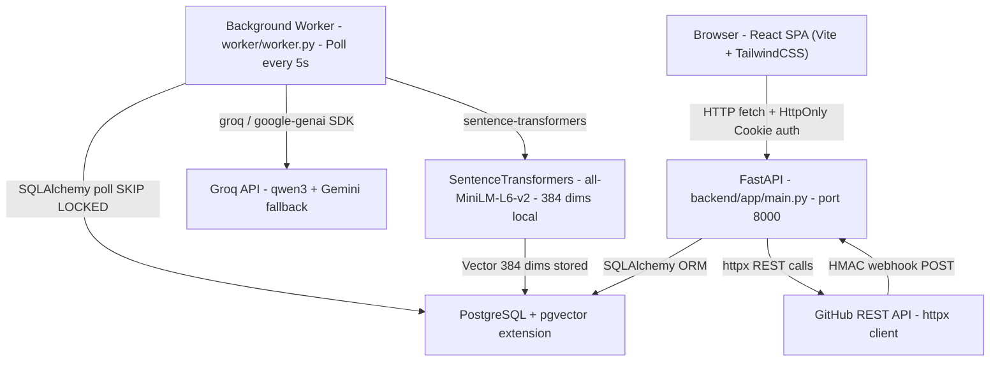

# 01 — System Overview

## What Is RepoMind 2.0?

RepoMind 2.0 is an **AI-powered Pull Request intelligence and code review platform**. It ingests GitHub repositories, indexes their documentation and source code into a vector database, then automatically reviews pull requests using a multi-stage pipeline that combines:

- **Static analysis** (Ruff + Bandit)
- **Semantic conflict detection** (rule-based + RAG-grounded)
- **Evidence-validated AI review** (Groq / Gemini LLM)
- **Explainable risk scoring** (7 weighted factors)
- **Human approval gate** (RBAC-controlled)
- **Conversational AI assistant** (repository-scoped RAG chat)

---

## High-Level Architecture

```
BROWSER (React SPA - Vite, React Router, TanStack Query)
- LoginPage / DashboardPage / RepositoriesPage
- PullRequestsPage / ReviewPage / ChatPage / AnalyticsPage
- SettingsPage / SecurityBrowserPage
- usePermissions hook (client-side RBAC)
          |
          | HTTP (fetch, credentials: 'include', cookie-auth)
          v
FASTAPI APPLICATION (uvicorn, port 8000)
backend/app/main.py
- CORSMiddleware (localhost:5173 only)
- Routers: auth / organizations / github / review / webhooks
           chat / analytics / ml
          |                          |
          | SQLAlchemy               | httpx
          v                          v
PostgreSQL 15+              External Services
+ pgvector                  - GitHub REST API (httpx)
                            - Groq API (groq SDK)
Tables:                     - Gemini API (google-genai)
  user
  organization
  org_membership
  project
  repository
  github_connection
  document
  document_chunk     <- Vector(384) via pgvector
  pull_request
  commit
  review_run
  finding
  finding_evidence
  linter_result
  conflict
  risk_assessment
  human_decision
  chat_session
  chat_message
  ml_prediction
  audit_log
  webhook_event
          ^
          | SQLAlchemy (SessionLocal)
BACKGROUND WORKER (standalone Python process)
worker/worker.py
- Polls review_run (status='pending') every 5 seconds
- Polls repository (index_status='unindexed') every 5 seconds
- Uses SELECT FOR UPDATE SKIP LOCKED (no Redis / Celery)
- Executes run_review() -> full 11-stage pipeline
- Executes index_repository() -> embeddings + pgvector
          |
          | Local inference
SENTENCE TRANSFORMERS (all-MiniLM-L6-v2, 384-dim)
- LocalEmbedder.embed_chunks()
- TextChunker: 256 token max, 50 token overlap
```

---

## Technology Stack Summary

| Layer | Technology | Detail |
|---|---|---|
| Frontend Framework | React 18 | SPA |
| Frontend Build | Vite | Dev server port 5173 |
| Frontend Routing | React Router DOM v6 | BrowserRouter |
| Frontend Data | TanStack Query (React Query) v5 | QueryClientProvider |
| Frontend HTTP | fetch API (native) | credentials: 'include' |
| Frontend Auth | HttpOnly Cookie | Set by FastAPI |
| CSS Framework | Tailwind CSS v3 | Utility-first |
| Backend Framework | FastAPI | ASGI |
| Backend Server | Uvicorn | Port 8000 |
| ORM | SQLAlchemy v2 | Session-based |
| DB Migrations | Alembic | Version-controlled schema |
| Database | PostgreSQL 15+ | Primary store |
| Vector Search | pgvector 0.5+ | Cosine distance |
| Embedding Model | sentence-transformers/all-MiniLM-L6-v2 | 384-dim, local |
| Primary LLM | Groq (qwen/qwen3.8-27b) | With Gemini fallback |
| LLM Fallback | Gemini (gemini-3.6-flash) | FallbackProvider |
| PAT Encryption | cryptography.fernet | Symmetric AES-128-CBC |
| Password Hashing | bcrypt | 12 rounds |
| JWT | PyJWT HS256 | 12-hour expiry |
| GitHub Client | httpx | 30s timeout |
| Static Analysis | Ruff + Bandit | subprocess, no shell=True |
| Retry Logic | tenacity | Exponential backoff, 3 attempts |
| Worker Queue | PostgreSQL polling + SKIP LOCKED | No Redis/Celery required |

---

## Active Runtime Processes

```
Port 5173  -- Vite dev server (frontend React app)
Port 8000  -- FastAPI/uvicorn (backend REST API)
Worker     -- worker/worker.py polling PostgreSQL
```

---

## System Architecture Diagram (Mermaid)



---

## Repository Directory Map

```
repo/
+-- backend/
|   +-- alembic/              <- DB migration scripts
|   +-- app/
|   |   +-- main.py           <- FastAPI app entry point + router registration
|   |   +-- db.py             <- SQLAlchemy engine + SessionLocal + get_db()
|   |   +-- core/config.py    <- pydantic_settings Settings class (.env loading)
|   |   +-- auth/             <- Login, register, JWT cookies, bcrypt, RBAC deps
|   |   +-- organizations/    <- Projects, Repositories, Members CRUD
|   |   +-- github/           <- PAT encryption, GitHubClient, PR sync
|   |   +-- rag/              <- Loader, Chunker, Embedder, Repository, Retriever
|   |   +-- review/           <- ReviewRun pipeline, LLM provider, Evidence validator
|   |   +-- conflicts/        <- Semantic + mechanical conflict detection engine
|   |   +-- risk/             <- 7-factor risk scoring engine
|   |   +-- linter/           <- Ruff + Bandit subprocess execution
|   |   +-- chat/             <- AI chat sessions + RAG-grounded answers
|   |   +-- analytics/        <- Org-level metrics aggregation
|   |   +-- ml/               <- Heuristic-based PR prediction (baseline-v1 only)
|   |   +-- webhooks/         <- GitHub webhook HMAC verification + enqueue
|   |   +-- audit/            <- AuditLog model
|   +-- scripts/              <- Utility scripts
|   +-- tests/                <- Backend test suite
+-- frontend/
|   +-- src/
|   |   +-- App.jsx           <- Root component, routing, auth guard
|   |   +-- main.jsx          <- React DOM mount point
|   |   +-- lib/api.js        <- All API call functions (fetch wrapper)
|   |   +-- hooks/usePermissions.js  <- Client-side RBAC hook
|   |   +-- pages/            <- 9 page-level components
|   |   +-- components/       <- Layout + Review sub-components
|   +-- tests/
+-- worker/
|   +-- worker.py             <- Polling loop, crash recovery, SKIP LOCKED
+-- .env                      <- Environment variables (POSTGRES_URL, JWT_SECRET, etc.)
+-- docs/architecture/        <- This documentation set
```
