# REPOMIND IMPLEMENTATION BLUEPRINT

*Company platform, small-team-implementable. No code yet — this is the reviewable plan. Where the original research document's assumptions (Streamlit, no DB, no auth) don't fit a real company deployment, they're explicitly upgraded below, with the reasoning shown.*

---

## Part 1 — Executive Summary

RepoMind's job doesn't change with company scope: retrieve a repo's own rules via RAG, ground an LLM's PR review in them, predict PR risk with a small ML model, and prove both actually help via a controlled evaluation. What changes is *who* uses it and *how many* repos/teams it needs to serve — which pushes several decisions the research MVP correctly deferred (auth, a real database, background jobs, a proper frontend) from "later" to "now," because a shared internal tool has different requirements than a solo research prototype. Nothing here reopens the research-MVP decisions that still hold at company scale: no GitHub App yet, no microservices, no employee scoring, evaluation logically separated from production inference.

**Architecture: modular monolith + background workers. Technology: FastAPI + PostgreSQL/pgvector + React. Roles: 3. Frontend: 9 pages.** These match the architecture already reviewed in the prior turn; this document adds the database schema, API contract, task breakdown, and diagrams needed to actually start building.

---

## Part 2 — Requirements Analysis

| ID | Requirement | Type | Priority | Source | MVP? | Dependency |
|---|---|---|---|---|---|---|
| R-01 | Fetch PR diff/metadata from GitHub | Functional/GitHub | P0 | Original doc §10-11 | Yes | — |
| R-02 | Fetch repo docs (README/ARCHITECTURE/etc.) | Functional/GitHub | P0 | Original doc §7.2 | Yes | R-01 |
| R-03 | Chunk + embed repo docs | RAG | P0 | Original doc §7.3-7.4 | Yes | R-02 |
| R-04 | Retrieve top-k relevant chunks per PR | RAG | P0 | Original doc §7.5 | Yes | R-03 |
| R-05 | Run static analysis (ruff/bandit) | Functional | P0 | Original doc §21 | Yes | — |
| R-06 | LLM review producing structured findings | AI | P0 | Original doc §18-19 | Yes | R-04, R-05 |
| R-07 | Validate/reject malformed LLM JSON | AI | P0 | Original doc §25 (extended) | Yes | R-06 |
| R-08 | Predict PR cycle time (regression) | ML | P0 | Original doc §8.4 | Yes | historical PR data |
| R-09 | Predict PR delay (classification) | ML | P0 | Original doc §8.5 | Yes | historical PR data |
| R-10 | Rule-based baselines for both ML tasks | Evaluation | P0 | Original doc §33 | Yes | R-08, R-09 |
| R-11 | Generic/linter/RAG 3-way comparison | Evaluation | P0 | Original doc §9-12 | Yes | R-06 |
| R-12 | Persist review history, not just latest | Functional | **P1 — new for company scope** | Not in original (Streamlit, file storage) | Yes | Database |
| R-13 | Multi-user authentication | Functional | **P1 — new** | Not in original | Yes | Database |
| R-14 | Org/team/project/repo hierarchy | Functional | **P1 — new** | Not in original | Yes | R-13 |
| R-15 | Human accept/reject feedback per finding | Feedback | P0 (flagged as the one gap in the prior team-workflow review) | Not in original doc, added in review | Yes | R-06 |
| R-16 | Background processing for slow AI calls | DevOps | **P1 — new** | Not in original (was synchronous Streamlit) | Yes | Database |
| R-17 | Re-analysis on new commits | Functional | P1 | Original doc future work | Yes | R-06, R-12 |
| R-18 | GitHub App / webhooks / auto-trigger | GitHub | P3 | Original doc §16 (deferred) | No | — |
| R-19 | Inline PR comments on GitHub | GitHub | P3 | Original doc future work | No | R-18 |
| R-20 | Team/repo-level analytics (never individual ranking) | Analytics | P2 | Original doc "not built," prior review §H/§51 | No | R-12 |
| R-21 | Enterprise SSO | Security | P3 | Not in original | No | — |

**Contradictions resolved:** the original document's "no database, no auth, one Streamlit page" was correct for a research MVP and incorrect for a shared company tool serving multiple teams — resolved by explicitly splitting into three scopes below rather than picking one set of assumptions.

**Missing from the original:** persistent review history, multi-user access, and the feedback-recording mechanism — all added as P0/P1 here since a shared tool with no history and no way to record what humans decided cannot support the evaluation loop the original document itself considers essential.

---

## Part 3 — Architecture Decision (challenging the original)

| Original decision | Why it was reasonable (research MVP) | Still makes sense at company scale? | Recommended | Why |
|---|---|---|---|---|
| Streamlit, one page | Fastest path to proving the AI works | No | React frontend, 9 pages | Multiple teams/projects need real navigation, not a single form |
| No database (JSON/CSV) | Zero setup, sufficient for one dev's test PRs | No | PostgreSQL + pgvector | Multiple users writing feedback concurrently, review history needed for evaluation over time |
| No authentication | Single dev running it locally | No | Session-based auth, 3 roles | Shared company tool, must know who is submitting feedback |
| PR URL manual paste | Avoids GitHub App complexity for a research question | **Partially** | PAT + manual trigger for internal MVP; GitHub Actions next; App deferred | The "avoid GitHub App" reasoning still holds — automation doesn't require the heaviest option |
| No background worker | Synchronous 10-30s wait was fine for one developer | No | Simple job table + worker process | Multiple concurrent reviews across teams shouldn't block each other or the API |
| No GitHub App | Correctly avoids OAuth/webhook/App-install cost before AI is proven | **Yes, unchanged** | Still deferred | Same reasoning applies regardless of company vs. solo — automation is not the open research question |

**Architecture type: Modular monolith + asynchronous background workers.** Same reasoning as the earlier architecture review: one team, one deploy, no component needs independent scaling — except long-running AI calls, which get a worker tier (a process boundary, not a service boundary) so they don't block the API.

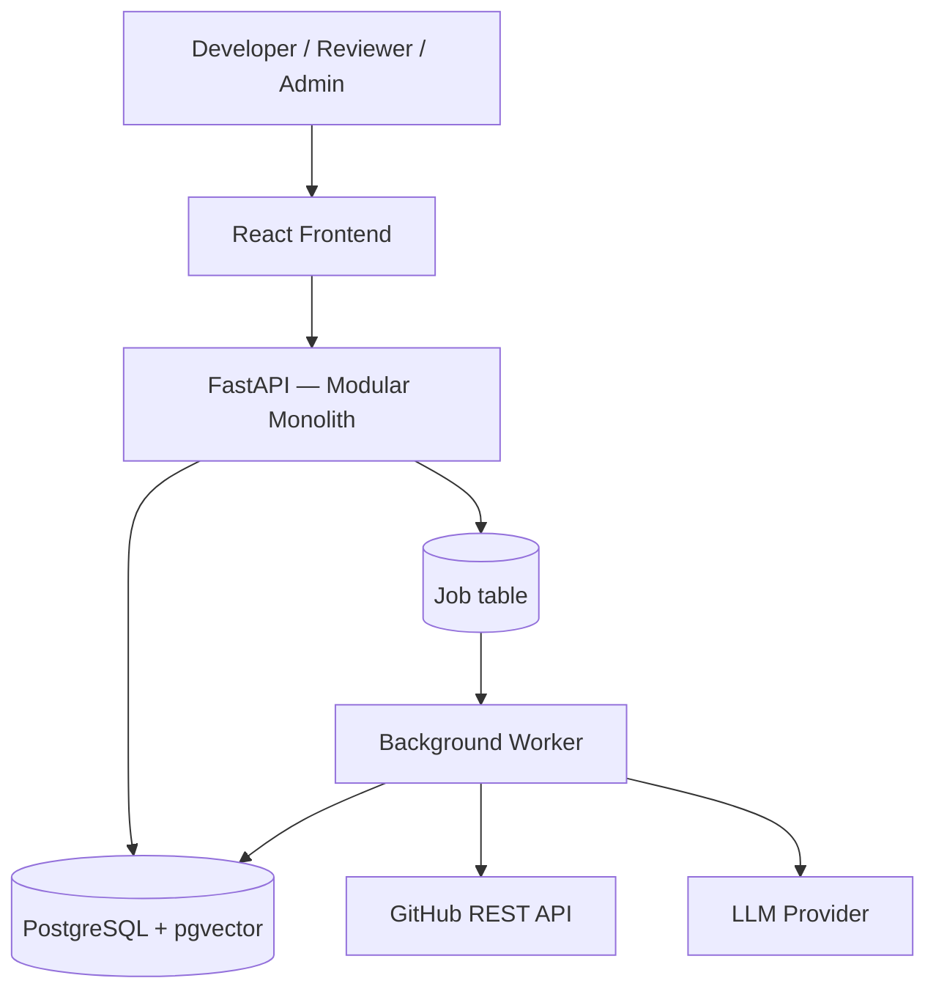

---

## Part 4 — Technology Stack

| Layer | Choice | Purpose | Alternative | Why rejected | MVP | Production |
|---|---|---|---|---|---|---|
| Frontend | React + TypeScript + Tailwind | Multi-page internal app | Next.js | SSR/SEO unneeded behind auth | Yes | Yes |
| Backend | FastAPI + Pydantic | API + validation | Django | ORM/admin-first design solves problems RepoMind doesn't have | Yes | Yes |
| ORM | SQLAlchemy | Typed DB access | Raw SQL | Harder to maintain across migrations | Yes | Yes |
| Database | PostgreSQL | Relational org/project/PR/finding data | MongoDB | Data is inherently relational | Yes | Yes |
| Vector storage | pgvector (same PG instance) | RAG chunk embeddings | Qdrant/Pinecone | Operational overhead unjustified at this chunk volume | Yes | Yes, until scale says otherwise |
| Background jobs | Simple job table + polling worker | Async AI review jobs | Celery | Redis+broker overhead not justified at this job volume | Yes | Consider Celery/RQ only if job volume grows substantially |
| Embeddings | sentence-transformers (local) | Doc chunk vectors | API embeddings | Avoids sending doc content to a third party, no per-call cost | Yes | Yes |
| LLM | Configurable provider (Claude API default) | Structured review generation | Self-hosted model | Only justified if private-repo policy requires it | Yes | Yes, with self-hosted as an option |
| GitHub | REST API + PAT | PR/doc fetch | GitHub App | Deferred per Part 3 | Yes | GitHub Actions bridge, App only if justified |
| Deployment | Docker Compose | One-team, one-deploy reality | Kubernetes | No independent-scaling need | Yes | Same, until concrete scale evidence appears |

---

## Part 5 — System Architecture

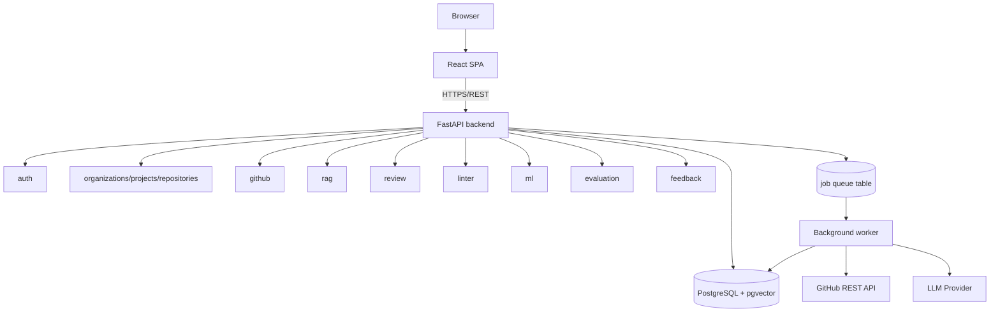

---

## Part 6 — Module Architecture

| Module | Responsibilities | Inputs | Outputs | Key entities | APIs | Depends on |
|---|---|---|---|---|---|---|
| `auth` | Login, sessions, org membership | credentials | session token | User, OrgMembership | `/auth/*` | — |
| `organizations` | Org/project/repo hierarchy | org data | hierarchy records | Organization, Project, Repository | `/organizations/*`, `/projects/*`, `/repositories/*` | auth |
| `github` | GitHub API client, doc/diff/PR fetch | PAT, repo ref | PR data, docs | GitHubConnection, PullRequest, Commit | `/repositories/{id}/pull-requests` | organizations |
| `rag` | Chunk, embed, retrieve, strictly repo-scoped | repo docs | ranked chunks | Document, DocumentChunk | (internal, used by review) | github |
| `linter` | Static analysis orchestration | changed files | normalized findings | LinterResult | (internal) | github |
| `review` | Build LLM context, call LLM, validate output | diff, chunks, lint | Finding[] | ReviewRun, Finding | `/pull-requests/{id}/review`, `/review-runs/{id}` | rag, linter, github |
| `ml` | Feature extraction, cycle-time/delay models | PR metadata | predictions | MLPrediction | (internal, surfaced on PR page) | github |
| `evaluation` | 3-way comparison, ML baseline comparison | test set, review outputs | metrics | EvaluationRun | `/evaluations/*` | review, ml |
| `feedback` | Accept/reject/ignore per finding | user decision | FindingFeedback rows | FindingFeedback | `/findings/{id}/feedback` | review |
| `audit` | Log sensitive actions | any mutating action | AuditLog rows | AuditLog | (internal) | all modules |

Dependency direction is strictly one-way: `github` never imports from `rag`/`review`; `evaluation` is a leaf, nothing depends on it.

---

## Part 7 — Database Architecture

| Table | Key columns | Notes |
|---|---|---|
| `user` | id, email, password_hash, created_at | |
| `organization` | id, name, created_at | tenant boundary |
| `organization_membership` | id, user_id (FK), organization_id (FK), role (enum: member/team_lead/org_admin) | |
| `project` | id, organization_id (FK), name | |
| `repository` | id, project_id (FK), github_owner, github_name, default_branch, index_status, last_indexed_at | |
| `github_connection` | id, organization_id (FK), encrypted_token, scope, created_at | one per org (or per repo if scoped that way) |
| `pull_request` | id, repository_id (FK), github_number, title, author, state, created_at, merged_at, additions, deletions, files_changed | |
| `commit` | id, pull_request_id (FK), sha, created_at | for re-analysis diffing |
| `document` | id, repository_id (FK), path, content_hash, updated_at | |
| `document_chunk` | id, document_id (FK), **repository_id (FK, denormalized for isolation)**, text, embedding (vector), chunk_index | repository_id present here directly so every retrieval query filters on it without a join |
| `review_run` | id, pull_request_id (FK), commit_sha, status (enum), repomind_version, prompt_version, llm_model, rag_enabled (bool), started_at, completed_at | |
| `finding` | id, review_run_id (FK), type (enum), severity (enum), file, line, title, explanation, rule_source, recommendation, confidence, status (enum: open/accepted/rejected/resolved) | |
| `finding_feedback` | id, finding_id (FK), user_id (FK), decision (enum), reason, created_at | append-only |
| `linter_result` | id, review_run_id (FK), tool, raw_output (json) | |
| `ml_prediction` | id, pull_request_id (FK), model_version, predicted_cycle_time_hours, delay_probability, created_at | |
| `evaluation_run` | id, run_at, config (json: variant, dataset_version), precision, recall, f1, false_positive_rate, groundedness | |
| `job` | id, type, status (enum: pending/running/completed/failed/cancelled), payload (json), result (json), retries, created_at, updated_at | the "queue" |
| `audit_log` | id, user_id (FK), action, target_type, target_id, created_at | |

**Deliberately absent:** `developer_score`, `notification`, `task`, `comment_thread` — none serve a requirement in Part 2.

### Migration Plan (representative)

| Migration | Adds | Reason |
|---|---|---|
| 001 | `user`, `organization`, `organization_membership` | Phase 3 (auth) |
| 002 | `project`, `repository`, `github_connection` | Phase 4 |
| 003 | `pull_request`, `commit` | Phase 5 |
| 004 | `document`, `document_chunk` (+ pgvector extension) | Phase 6-7 |
| 005 | `review_run`, `finding`, `linter_result` | Phase 8-9 |
| 006 | `finding_feedback` | Phase 12 |
| 007 | `job` | Phase 13 (async re-analysis) |
| 008 | `ml_prediction` | Phase 15 |
| 009 | `evaluation_run` | Phase 14 |
| 010 | `audit_log` | Phase 17 (security hardening) |

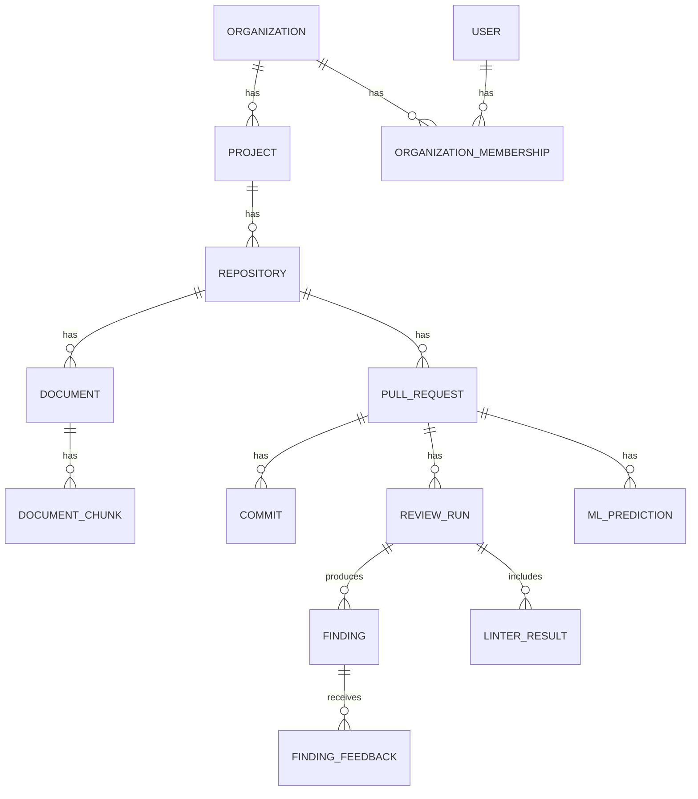

---

## Part 8 — API Architecture

| Method | Path | Purpose | Auth | Service |
|---|---|---|---|---|
| POST | `/auth/login` | Authenticate | — | auth |
| GET | `/organizations/{id}/projects` | List projects | session | organizations |
| GET | `/projects/{id}/repositories` | List repos | session | organizations |
| POST | `/repositories/connect` | Connect GitHub repo | session, org_admin | github |
| GET | `/repositories/{id}` | Repo detail + index status | session | organizations |
| GET | `/repositories/{id}/pull-requests` | List PRs | session | github |
| GET | `/pull-requests/{id}` | PR detail | session | github |
| POST | `/pull-requests/{id}/review` | Trigger review (creates a `job`) | session | review |
| GET | `/review-runs/{id}` | Review run detail + findings | session | review |
| POST | `/findings/{id}/feedback` | Accept/reject/ignore | session | feedback |
| GET | `/evaluations` | List evaluation runs | session | evaluation |
| POST | `/evaluations/run` | Kick off comparison experiment | session, team_lead+ | evaluation |
| POST | `/webhooks/github` | Webhook receiver (Production only) | signature | github |

No endpoints exist for anything not in Part 2's requirements list — no `/notifications`, `/tasks`, `/developer-scores`.

---

## Part 9 — Frontend Architecture

**9 pages**, matching the prior architecture review, extended with route/component detail:

| Route | Purpose | Key components | Loading/Empty/Error states |
|---|---|---|---|
| `/login` | Auth entry | LoginForm | error on bad credentials |
| `/dashboard` | Org overview | ProjectList, RecentActivity | empty state for new orgs |
| `/projects` | List projects | ProjectCard[] | empty state, create prompt (admin only) |
| `/projects/:id` | Repos in a project | RepositoryCard[] | — |
| `/projects/:pid/repositories/:rid` | Repo overview, rules, PR list (tabs) | RepoHeader, RulesList, PRList | loading spinner during indexing |
| `/repositories/:rid/pull-requests/:prid` | Core review page | PRHeader, PRMetadata, FindingsSummary, FindingList→FindingCard, LinterResults, RiskPanel, ReviewTimeline | loading during async review job; error state on job failure |
| `/evaluation` | Comparison table | EvaluationTable, RunEvaluationButton | empty state before first run |
| `/settings` | Profile, org, GitHub connection | ProfileForm, GitHubConnectionPanel, MemberList | — |
| `/team-analytics` (deferred, P2) | Team/repo trends only | TrendCharts | — |

### Component Breakdown — PR Page

```
PullRequestPage
├── PRHeader (title, author, status)
├── PRMetadata (files, additions/deletions)
├── RiskPanel (ML cycle-time + delay prediction)
├── FindingsSummary (counts by severity)
├── FindingList
│   └── FindingCard (severity, category, file:line, evidence, recommendation, accept/reject buttons)
├── LinterResults (raw static-analysis output, collapsed by default)
└── ReviewTimeline (history of review_runs for this PR)
```

### State Management

| State type | Used for | Tool |
|---|---|---|
| Server state | Projects, repos, PRs, findings | React Query (or equivalent fetch+cache) — no Redux needed |
| Client state | UI toggles (expanded finding, filter selection) | local component state |
| URL state | Current project/repo/PR id, active tab | route params |
| Form state | Login, GitHub connection, feedback reason | local form state |

No global state library — nothing here requires cross-cutting client state beyond what the router and query cache already provide.

---

## Part 10 — User Journeys

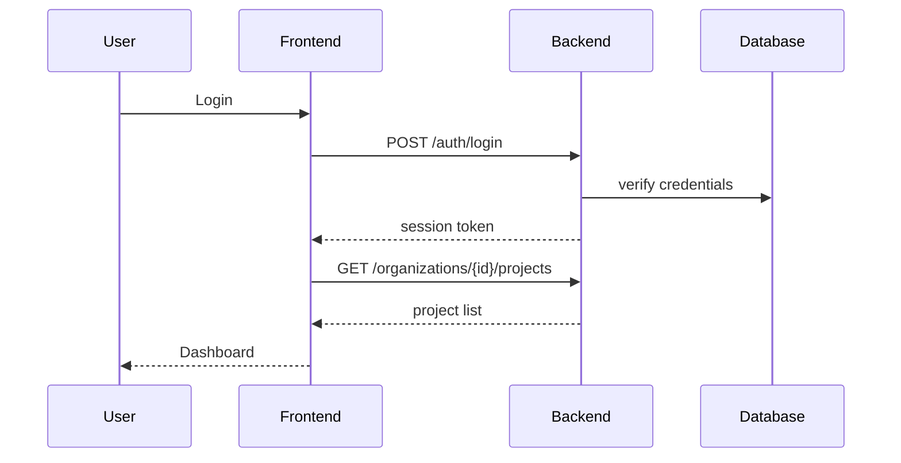

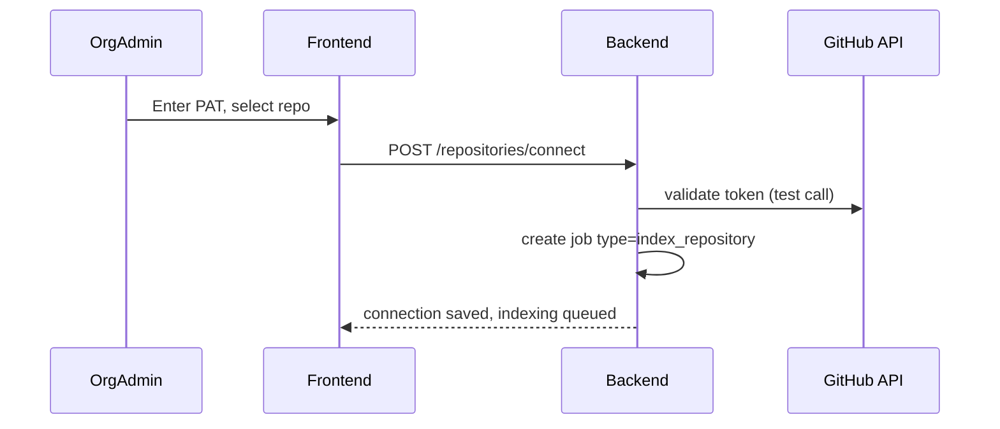

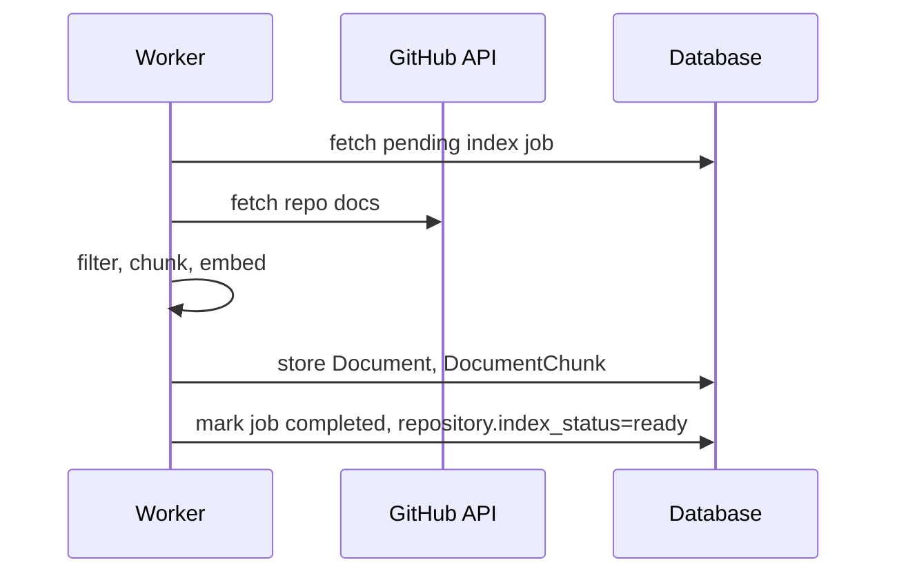

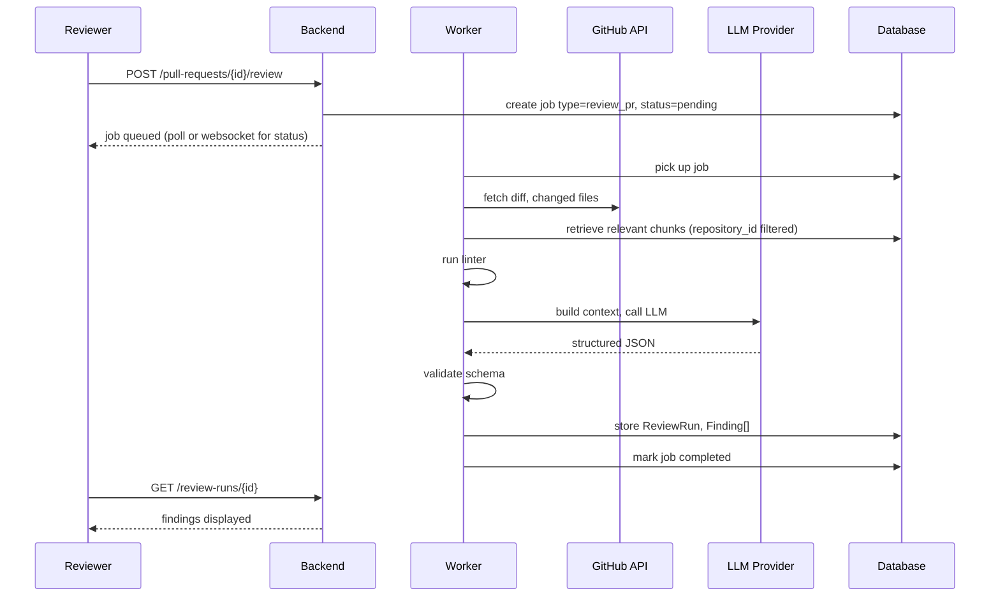

```mermaid
sequenceDiagram
    participant Dev as Developer
    participant GH as GitHub
    participant API as Backend
    participant W as Worker
    Dev->>GH: push new commit
    Note over API: MVP — manual re-trigger;<br/>Production — webhook auto-fires
    API->>W: create job type=review_pr (new commit_sha)
    W->>W: re-run full pipeline (Part on re-analysis)
    W->>W: diff findings vs. previous run: NEW / PERSISTENT / RESOLVED
```

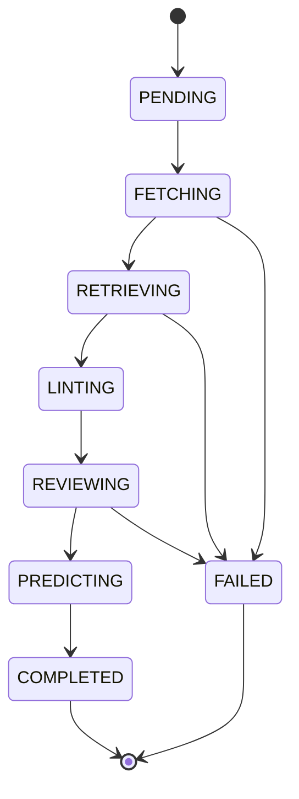

---

## Part 11 — GitHub Integration

**Phase 1 (internal MVP): PAT + manual trigger** — org admin enters a read-only PAT in Settings; reviewer clicks "Analyze" on the PR page, which creates a job. **Phase 2: GitHub Actions bridge** — a workflow file calling RepoMind's API on `pull_request` events, no OAuth/webhook hosting needed. **Phase 3 (deferred, P3): GitHub App** — only if inline, cross-repo PR comments become an actual requirement.

Rate limits/retries: standard GitHub REST rate limit (5000/hr authenticated) is not a concern at internal-team PR volume; the `github` module retries once on transient 5xx, surfaces 403/429 as a job failure with a clear message (not a silent retry loop).

---

## Part 12 — AI Architecture

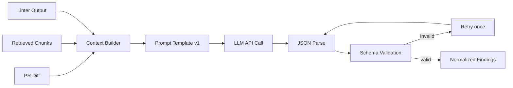

Services: `DocumentLoader`, `DocumentFilter`, `Chunker`, `EmbeddingService`, `Retriever` (rag module); `ContextBuilder`, `PromptBuilder`, `LLMClient`, `OutputParser`, `FindingValidator`, `ReviewService` (review module). Each is a plain function/class behind a narrow interface — no framework-level abstraction layer needed at this size.

---

## Part 13 — RAG Architecture

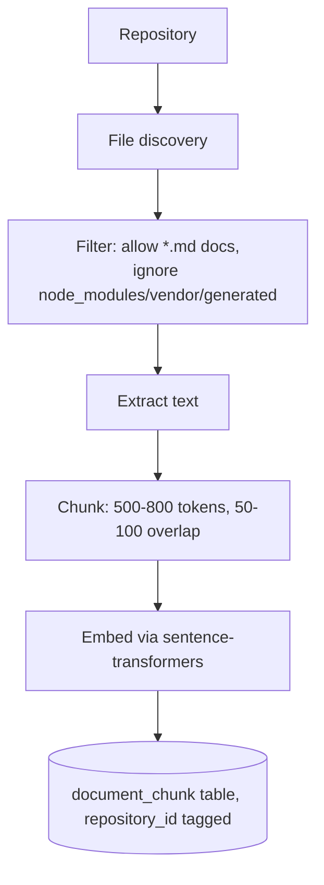

Retrieval: diff → derived query → embed → pgvector cosine similarity, **filtered by `repository_id` on every query** → top-k (3-5) → passed to context builder with source citations preserved. **Re-indexing:** triggered when a document's content hash changes, not on every PR — avoids re-embedding unchanged docs. **Repository isolation** is enforced at the query level (a `WHERE repository_id = :id` clause on every retrieval), not merely assumed from separate embedding runs.

---

## Part 14 — LLM Implementation

**Prompt construction:** system instruction (role, constraints) + retrieved chunks (with `source` tags) + linter output + diff, requesting JSON-only output. **Prompt injection defense:** repository content (README, docs, PR description, commit messages, code comments) is explicitly labeled in the prompt as *untrusted evidence*, never as system-level instructions — the system instruction is fixed and outside any repository-sourced text; the model is told explicitly not to follow instructions found inside retrieved content.

**Output schema:**
```json
{
  "findings": [
    {
      "severity": "high",
      "category": "security",
      "file": "src/example.py",
      "line": 42,
      "title": "...",
      "problem": "...",
      "evidence": "...",
      "repository_rule": "...",
      "recommendation": "...",
      "confidence": 0.91
    }
  ]
}
```

**Failure handling:** invalid JSON → retry once with a stricter instruction → if still invalid, mark the review job `FAILED` with the raw output logged for debugging, never silently drop it. Invalid line number → finding kept but line set to null, flagged for human attention. Missing evidence on a `standards_violation` → finding downgraded in the UI (shown but visually marked "unverified citation") rather than discarded, since it's still potentially useful, just not groundedness-verified.

---

## Part 15 — Static Analysis

| Tool | Detects | Runs on | Output → |
|---|---|---|---|
| ruff | Style, correctness lint | changed `.py` files | `linter_result`, fed into LLM context |
| bandit | Security issues | changed `.py` files | same |
| pytest | Test results (if applicable) | test files touched by diff | same |

Language detection via file extension selects the relevant tool set — adding a language means adding a dictionary entry, not restructuring the module. Linter findings are stored and displayed **separately tagged** from LLM findings (`source: static_analysis` vs `source: llm`), never merged into one undifferentiated list.

---

## Part 16 — ML Architecture

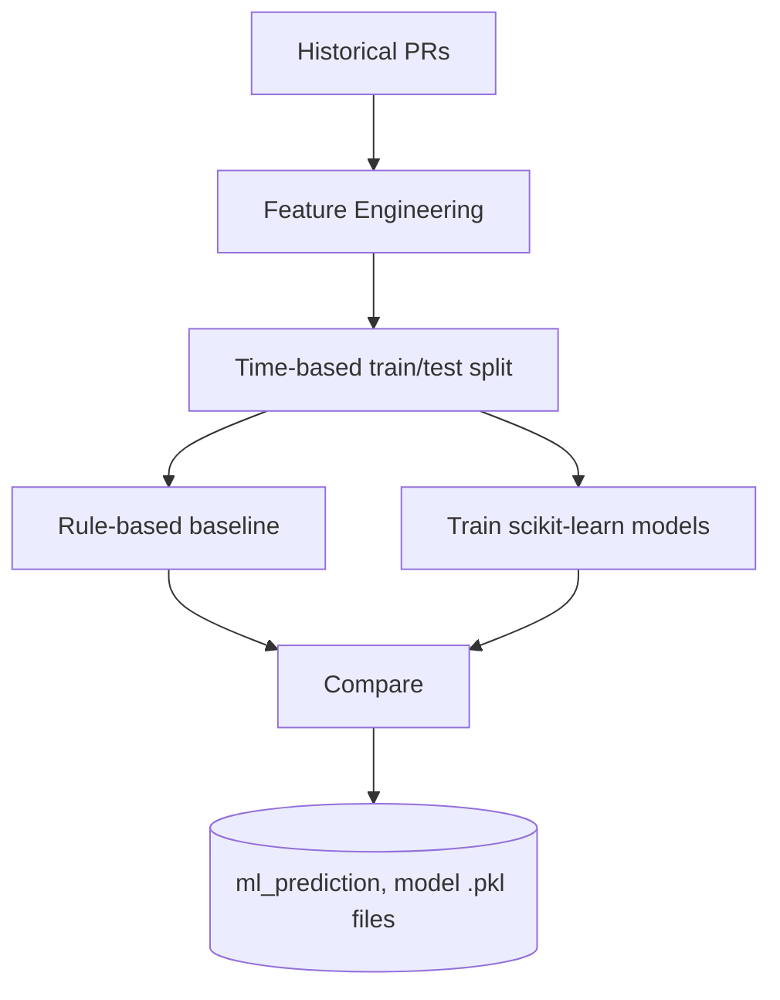

Regression (cycle time): Linear Regression → Random Forest → Gradient Boosting, evaluated by MAE/RMSE. Classification (delay): Logistic Regression → Random Forest, evaluated by Precision/Recall/F1/ROC-AUC. **Leakage prevention:** only features knowable at PR-open time are used (no final review count, no `merged_at`); split is chronological, not random. Models are serialized to versioned `.pkl` files; inference is a synchronous, fast (<100ms) load-and-predict called from the `review_service` alongside the AI review, not a separate serving system.

---

## Part 17 — Evaluation Architecture

**Kept logically separate from production inference**, per the source document's own principle:

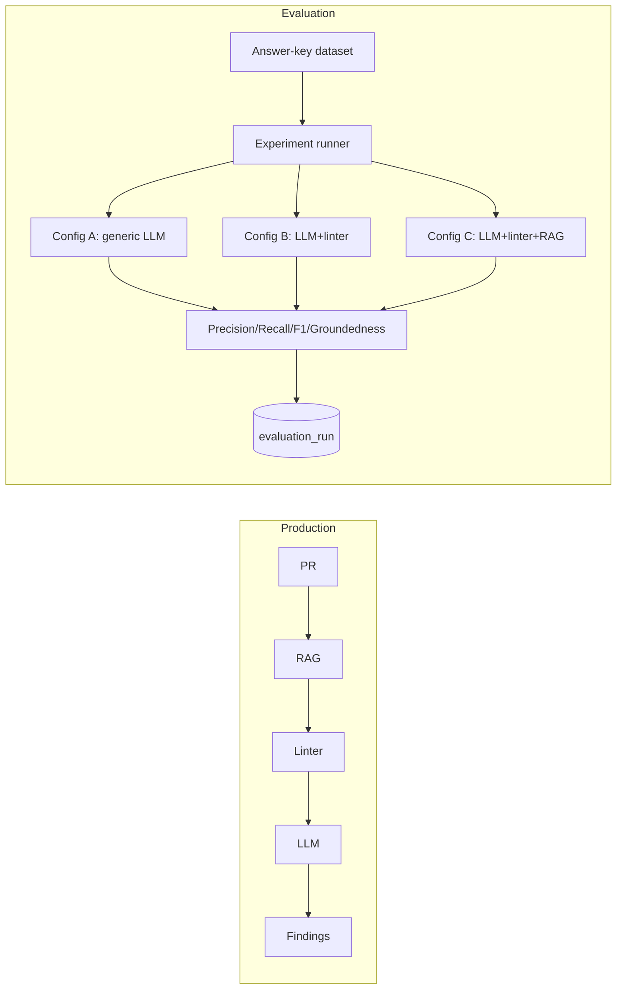

Each `evaluation_run` records: variant config, dataset version, prompt version, embedding version, retriever config (top-k), timestamp — full reproducibility. Evaluation runs against the labeled test set are triggered manually (Settings/Evaluation page button), never automatically mixed into production review traffic — an uncontrolled prompt change in production must not silently alter what an evaluation run is measuring.

---

## Part 18 — Security

| Control | Implementation |
|---|---|
| Secrets | PAT/LLM keys encrypted at rest in `github_connection` (per-org, not a shared `.env`), never logged |
| Authorization | Every query filtered by `organization_id`/`repository_id` derived from session, never trusted from client input |
| Repository isolation | `document_chunk.repository_id` filter on every retrieval query (Part 13) |
| Prompt injection | Repository content labeled as untrusted evidence in the prompt, never as instructions (Part 14) |
| Webhook signatures | Verified once webhooks exist (Production phase) |
| Rate limiting | Standard per-user request rate limit on the API |
| Audit logging | GitHub connection changes, org membership changes, feedback actions, evaluation runs |
| Data retention | Feedback and findings retained; raw diffs/doc text not retained beyond the review record itself |
| Source-code privacy disclosure | Org admins are told at connection time that PR diffs are sent to the configured LLM provider |

---

## Part 19 — Observability

Structured logs per pipeline stage (fetch, retrieve, lint, LLM call, predict), with timing. Track: LLM token usage and $ cost per call, GitHub API failures, RAG retrieval latency, job failure rate, review duration end-to-end. No source code in logs beyond what's needed for a specific debugging session, and that's time-boxed, not retained indefinitely. No APM/tracing infrastructure at this scale — structured logs + the `job` table's own status history cover debugging needs.

---

## Part 20 — Testing

| Level | Covers | Priority |
|---|---|---|
| Unit | Chunker, GitHub parser, output parser, feature engineering | P0 |
| Integration | GitHub client against a real test repo, RAG retrieval end-to-end, DB migrations | P0 |
| API | Every endpoint in Part 8, auth/authz enforcement | P0 |
| **AI evaluation regression** | Run the labeled answer-key test set through the pipeline on every change to prompt/RAG config; assert metrics don't regress | **P0 — the most important suite** |
| RAG isolation | Explicit test that repo A's docs are never retrieved for repo B's PR | P0 |
| Prompt injection | A test PR whose diff/docs contain an embedded fake instruction ("ignore previous instructions...") — assert the LLM does not comply | P0 |
| Frontend | Component rendering, PR page states (loading/empty/error) | P1 |
| E2E | Login → project → repo → PR → review → feedback → re-analysis | P1 |

**Error Handling Matrix**

| Failure | Detection | User Experience | Retry? | Logging |
|---|---|---|---|---|
| GitHub unavailable/rate limit | HTTP status | Job fails with clear message, retry button | Once, backoff | Yes |
| Repository not accessible (bad PAT scope) | 403/404 on fetch | "Check repository permissions" message | No | Yes |
| PR too large | Pre-check diff size | Per-file review, report notes "reviewed in parts" | N/A | Yes |
| Embedding failure | Exception in embed step | Review proceeds without RAG, findings tagged "no repo context available" | Once | Yes |
| LLM timeout | Timeout exception | Job fails, retry button shown | Once | Yes |
| LLM invalid JSON | Schema validation fails | Retry once, then job fails with raw output logged | Once | Yes |
| Linter failure | Non-zero exit unexpected | Review proceeds without static-analysis evidence, noted in report | No | Yes |
| Database failure | Connection error | 500, generic error page | No (fail fast) | Yes |
| Webhook invalid signature | Signature check | 401, request dropped | No | Yes |
| Worker crash mid-job | Job stuck in RUNNING past timeout | Job auto-marked FAILED by a sweep, retry available | Manual | Yes |

---

## Part 21 — Deployment

**Local:** Docker Compose — frontend, backend, worker, postgres, all on one machine. **Staging:** same stack on a single small VM, seeded with demo data (clearly separated from any real org data via a `demo=true` flag on the seed org, never mixed). **Production:** same Docker Compose stack on a managed VM or single small Kubernetes-free host; managed PostgreSQL optional once uptime matters more than cost. **No Kubernetes** — no component here has an independent-scaling profile that justifies it.

---

## Part 22 — Folder Structure

```
repomind/
├── frontend/
│   ├── src/{pages,components,lib,hooks,types}/
│   └── tests/
├── backend/
│   ├── app/
│   │   ├── main.py, config.py, dependencies.py
│   │   ├── auth/  organizations/  github/  rag/  review/  linter/  ml/  evaluation/  feedback/  audit/  common/
│   └── tests/
├── worker/
│   └── jobs/{index_repository.py, review_pr.py, run_evaluation.py}
├── database/
│   └── migrations/  (001_...  through  010_...)
├── infrastructure/
│   └── docker-compose.yml
├── docs/
│   ├── architecture.md  setup.md  api.md  ai-pipeline.md  rag.md  evaluation.md  deployment.md  security.md
│   └── adr/
├── scripts/
│   ├── seed_demo_data.py
│   ├── run_evaluation.py
│   └── train_ml_models.py
├── .env.example
├── .gitignore
└── README.md
```

---

## Part 23 — Implementation Phases

| Phase | Objective | Key files/modules | DB changes | Acceptance criteria | Complexity |
|---|---|---|---|---|---|
| 0 | Project init | repo scaffold, `.env.example`, Docker Compose skeleton | — | `docker compose up` boots empty services | Low |
| 1 | Backend foundation | `main.py`, `config.py`, health endpoint | — | `/health` returns 200 | Low |
| 2 | Database | SQLAlchemy setup, migration tooling | migration 001 skeleton | migrations run cleanly | Low |
| 3 | Authentication | `auth/` module | migration 001 | login returns valid session; unauth requests rejected | Medium |
| 4 | Org/Project/Repository | `organizations/` module | migration 002 | can create org→project→repo via API | Medium |
| 5 | GitHub integration | `github/` module | migration 003 | given a connected repo, can fetch PR diff + docs | Medium |
| 6 | Repository indexing | `rag/loader.py`, `chunker.py` | migration 004 | docs chunked and stored with repository_id | Medium |
| 7 | RAG retrieval | `rag/embedder.py`, `retriever.py` | (uses 004) | known query returns correct chunk; cross-repo isolation test passes | High |
| 8 | LLM review | `review/` module | migration 005 | structured, validated findings produced for a real PR | High |
| 9 | Static analysis | `linter/` module | (uses 005) | lint findings stored and tagged separately from LLM findings | Low |
| 10 | Review API | review endpoints | — | `POST /pull-requests/{id}/review` creates a job, `GET /review-runs/{id}` returns findings | Medium |
| 11 | Review frontend | PR page + components | — | findings visible with citations in the UI | Medium |
| 12 | Feedback | `feedback/` module | migration 006 | accept/reject persists, visible on reload | Low |
| 13 | Background jobs / re-analysis | `job` table, worker process | migration 007 | review runs asynchronously; new commit triggers re-analysis; findings reconciled NEW/PERSISTENT/RESOLVED | High |
| 14 | Evaluation | `evaluation/` module | migration 009 | 3-way comparison table produced and displayed | High |
| 15 | ML risk prediction | `ml/` module | migration 008 | regressor/classifier trained, beat baseline comparison shown | Medium |
| 16 | Analytics (P2, optional) | team/repo trend views only | — | no individual ranking anywhere in the schema or UI | Low |
| 17 | Security hardening | secret encryption, audit log | migration 010 | audit log populated on sensitive actions | Medium |
| 18 | Testing | full suite from Part 20 | — | AI evaluation regression suite passes in CI | Medium |
| 19 | Deployment | Docker Compose, CI/CD pipeline | — | staging deploy succeeds from a clean checkout | Medium |

---

## Part 24 — Epic Breakdown

```
EPIC-01 Foundation           (Phases 0-2)
EPIC-02 Authentication       (Phase 3)
EPIC-03 Organization Mgmt    (Phase 4)
EPIC-04 GitHub Integration   (Phase 5)
EPIC-05 Repository Intelligence (Phases 6-7)
EPIC-06 AI Review            (Phases 8-9)
EPIC-07 Review Platform      (Phases 10-11)
EPIC-08 Feedback             (Phase 12)
EPIC-09 Async & Re-analysis  (Phase 13)
EPIC-10 Evaluation           (Phase 14)
EPIC-11 ML Risk Prediction   (Phase 15)
EPIC-12 Analytics (P2)       (Phase 16)
EPIC-13 Security             (Phase 17)
EPIC-14 Quality & Deployment (Phases 18-19)
```

---

## Part 25 — Detailed Task Breakdown (representative sample per epic)

```
REPOMIND-001  Initialize monorepo structure
Description: Create frontend/, backend/, worker/, database/, infrastructure/ skeletons.
Dependencies: none
Files: repository root, .gitignore, README.md
Acceptance Criteria: repo clones and shows the structure in Part 22
Tests: none (structural)
Complexity: Low

REPOMIND-002  FastAPI app skeleton + health endpoint
Dependencies: REPOMIND-001
Files: backend/app/main.py, config.py
Acceptance Criteria: GET /health returns 200
Tests: test_health.py
Complexity: Low

REPOMIND-003  PostgreSQL + SQLAlchemy + Alembic setup
Dependencies: REPOMIND-002
Files: backend/app/database.py, database/migrations/env.py
Acceptance Criteria: `alembic upgrade head` runs cleanly against an empty DB
Tests: test_database_connection.py
Complexity: Low

REPOMIND-004  User + session auth
Dependencies: REPOMIND-003
Files: backend/app/auth/{models,service,routes}.py
Acceptance Criteria: POST /auth/login returns a valid session for correct credentials, 401 otherwise
Tests: test_auth.py (valid login, invalid password, missing user)
Complexity: Medium

REPOMIND-005  Organization/Project/Repository models + APIs
Dependencies: REPOMIND-004
Files: backend/app/organizations/{models,service,routes}.py
Acceptance Criteria: authenticated org_admin can create org→project→repo; other roles cannot create orgs
Tests: test_organizations.py
Complexity: Medium

REPOMIND-006  GitHub client (PAT-based)
Dependencies: REPOMIND-005
Files: backend/app/github/{client,parser,models}.py
Acceptance Criteria: given a connected repo, fetch_pr(number) returns diff + metadata from real GitHub
Tests: test_github_client.py (mocked API), one live integration test against a public repo
Complexity: Medium

REPOMIND-007  Document discovery + chunking
Dependencies: REPOMIND-006
Files: backend/app/rag/{loader,chunker}.py
Acceptance Criteria: given a repo with README+ARCHITECTURE.md, produces correctly-sized, repository_id-tagged chunks
Tests: test_chunker.py
Complexity: Medium

REPOMIND-008  Embedding + retrieval + isolation test
Dependencies: REPOMIND-007
Files: backend/app/rag/{embedder,retriever}.py
Acceptance Criteria: known query returns the correct chunk; a cross-repository isolation test explicitly asserts repo A's chunks never appear for repo B's query
Tests: test_retriever.py, test_repository_isolation.py (this test must exist and must fail loudly if isolation breaks)
Complexity: High

REPOMIND-009  LLM review service + prompt v1 + output validation
Dependencies: REPOMIND-008, static-analysis task (parallel)
Files: backend/app/review/{prompt_v1,llm_client,output_parser,service}.py
Acceptance Criteria: given a real PR diff + retrieved chunks + lint output, produces valid, schema-conformant findings; invalid JSON triggers exactly one retry then a FAILED job
Tests: test_output_parser.py (valid, invalid, missing-field cases), test_prompt_injection.py
Complexity: High

... (the same level of detail continues for every phase in Part 23 — GitHub Actions integration, background job worker, evaluation runner, ML training scripts, feedback endpoints, and frontend pages each get their own REPOMIND-0XX tasks following this exact template, in the dependency order shown in Part 26)
```

---

## Part 26 — Implementation Dependency Graph

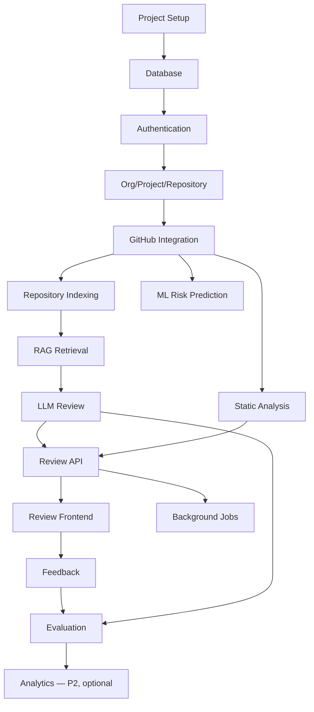

**Parallelizable:** frontend shell scaffolding can start alongside GitHub integration (Phase 5), since it only needs mocked API responses initially. Static analysis (Phase 9) has no dependency on RAG (Phase 7) and can be built in parallel. ML (Phase 15) depends only on GitHub integration, not on RAG/LLM review, and can proceed independently once historical PR data is available — but should not delay Phase 14's evaluation, which is the project's central research deliverable.

---

## Part 27 — Acceptance Criteria (Given/When/Then, representative)

> **AI Review**
> Given a valid GitHub PR on a connected, indexed repository,
> when a user triggers a review,
> then RepoMind retrieves the PR diff, runs configured static analysis, retrieves repository-specific context filtered to that repository only, calls the configured LLM, validates the structured output against the finding schema, stores the review run and findings, and displays them with source attribution and confidence scores within the job's completion.

> **Repository Isolation**
> Given two connected repositories A and B with different documented rules,
> when a PR on repository A is reviewed,
> then no chunk originating from repository B ever appears in the retrieved context, verified by an automated test, not by manual inspection alone.

> **Feedback Loop**
> Given a displayed finding,
> when a reviewer clicks accept or reject,
> then a `finding_feedback` row is persisted with the user, decision, and timestamp, and the finding's status updates immediately in the UI without a page reload.

> **Re-analysis**
> Given a PR that has already been reviewed once,
> when a new commit is pushed and re-analysis is triggered,
> then the new review run's findings are diffed against the prior run, and each finding is classified as NEW, PERSISTENT, or RESOLVED before being displayed.

---

## Part 28 — Definition of Done

A feature is not complete until: code implemented and type-hinted; unit + integration tests written and passing; error handling implemented per Part 20's matrix; security considerations addressed (auth checks, input validation, no secret leakage); API documented in `docs/api.md`; frontend connected to the real API (no leftover mock data); database migration added if schema changed; structured logging added at the appropriate points; acceptance criteria (Part 27 style) written and verified.

---

## Part 29 — MVP Boundary

**Scope A — AI Research MVP** (already built/validated per the prior documents in this thread): GitHub PR + Linter + RAG + LLM + Evaluation, Streamlit, no auth, no DB. This proves the core research question and should not be discarded — its evaluation scripts and prompt logic port directly into Scope B's `review`/`evaluation` modules.

**Scope B — Internal Company MVP** (this document's primary target): everything in Parts 5-20 — auth, org/project/repo hierarchy, PostgreSQL, background jobs, React frontend, feedback loop, security basics. This is what phases 0-19 in Part 23 build.

**Scope C — Production Evolution** (explicitly out of scope for now): GitHub App, automatic webhooks, inline PR comments, enterprise SSO, advanced RBAC beyond the 3 roles, Slack/Teams integration, multi-organization scaling beyond a single company, a dedicated vector database service, advanced ML (drift detection, retraining pipelines), full observability/tracing stack, high availability.

---

## Part 30 — Risks

| Risk | Probability | Impact | Mitigation | Owner |
|---|---|---|---|---|
| LLM hallucinated standards violations | Medium | High (erodes trust) | Groundedness metric tracked every evaluation run; evidence field required; retry-then-fail on invalid output | AI eng |
| Cross-repository context leakage | Low (with the isolation test) | Critical | `repository_id` on `document_chunk` + mandatory isolation test (REPOMIND-008) | Backend eng |
| Prompt injection via repo content | Medium | High | Explicit untrusted-evidence framing in prompt; dedicated test case | AI eng |
| Private code sent to third-party LLM | N/A (policy, not bug) | High if undisclosed | Explicit disclosure at connection time; local-LLM option available | Security/PM |
| GitHub API rate limits | Low at internal team volume | Medium | Standard backoff/retry, surfaced clearly on failure | Backend eng |
| Large PR overwhelms LLM context | Medium | Medium | Per-file review + aggregation for oversized diffs | AI eng |
| LLM API cost growth | Medium as usage scales | Medium | Token/context limits, caching of unchanged doc embeddings | PM |
| ML data leakage | Low (explicit chronological split + feature audit) | High (invalidates the ML result) | Feature audit task before training, temporal split enforced in code | ML eng |
| Insufficient evaluation data | Medium (small internal test set initially) | Medium | Evaluation results reported with sample size, not overstated | AI eng |
| Scope creep toward developer scoring | Medium (data is "sitting there") | High (fairness/trust) | No `developer_score` entity exists in the schema; Part 51 principle enforced at data-model level, not just policy | PM |
| Worker/job stuck states | Low | Medium | Timeout sweep marks stuck RUNNING jobs FAILED, retry available | DevOps |

---

## Part 31 — Final Recommended Build Order

```
Phase 0-2  → Foundation, DB
Phase 3    → Auth
Phase 4    → Org/Project/Repository
Phase 5    → GitHub integration        ⎫
Phase 9    → Static analysis (parallel)⎬ can overlap
Phase 6-7  → Indexing + RAG            ⎭
Phase 8    → LLM review
Phase 10-11→ Review API + frontend
Phase 12   → Feedback
Phase 13   → Async jobs + re-analysis
Phase 14   → Evaluation                (the project's central deliverable — do not let ML delay this)
Phase 15   → ML risk prediction        (parallel-safe once Phase 5 data exists)
Phase 17-19→ Security, testing, deployment
Phase 16   → Analytics — build last, and only if a real, specific request for it appears
```

---

**Blueprint complete. The next step is implementation. Which phase should we start with?**
